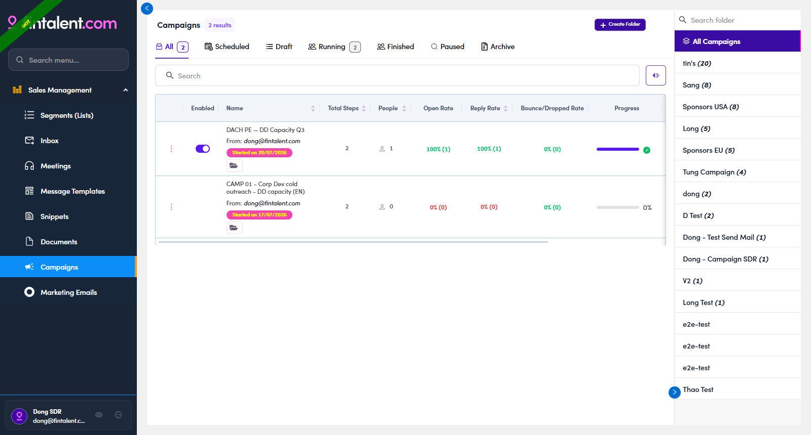

# 1.2 · Your workspace

> 1 · Log in & find your workspace

1. **1.3** — Log In drops you on **Campaigns** — your workspace inside **Sales Management**. Move around with the left menu (**8 items**); your account card is bottom-left. No Contacts/Companies pages — your lists and Inbox are the entry points.

   

   *1.2 — where Log In lands you: the Campaigns page, with the Sales Management menu on the left.*

Here's what each menu item is for:

| Menu | What you do here | What you can't |
|---|---|---|
| **Segments (Lists)** | Open the **lists assigned to you** and work the members — **Flows 2–6**. | Can't create a list, assign, or add/remove members — Ops owns that (O2–O5). |
| **Inbox** | **Read** replies and **reply in-thread** — **Flow 4**. | It's a reply queue — nothing to "create". |
| **Meetings** | — | — |
| **Message Templates** | Full **create / edit / delete** — use & build in **Flow 3.x.1**. | — |
| **Snippets** | Full **create / edit / delete** — use & build in **Flow 3.x.2**. | — |
| **Documents** | Full **create / edit / delete** — the 🗂 file library — **Flow 3.x.3**. | — |
| **Campaigns** | **View / build** multi-step campaigns — **Flow 6**. | Can't add people — Ops loads the audience. |
| **Marketing Emails** | **View / build** a single-blast email — **Flow 7**. | Can't add people — Ops loads the audience. |
