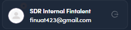

# 1.x.3 · Where I can open my account?

> 1 · Log in & find your workspace → 1.x · Edge cases

**Where I can open my account?** Your **account card** is at the **bottom-left** of the sidebar (avatar, name, email and a refresh icon, that's all; no view-as/eye control on an SDR login). **Click your name/avatar** to open **Update Admin Information** (5 tabs: General Setting, Billing, Payment, Activities Log and Email Configuration); log out from the account card's control (1.x.6).

*1.x.3: the account card (avatar · name · email · refresh); click your name to open settings.*
