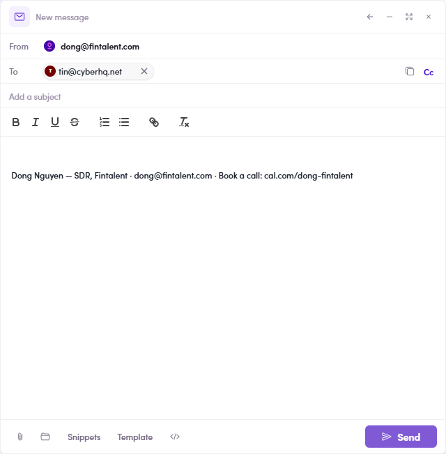

# 1.x.5 · Email signature

> 1 · Log in & find your workspace → 1.x · Edge cases

**Your email signature.** **Why it matters:** your signature is the sign-off block (name · title · company · phone · booking link) that gets **added automatically to the bottom of every email you send** — so every message looks consistent and professional and the prospect always knows who you are and how to reach or book you. On the **Email Configuration** tab you can **view** your current **Signature**, **Sender Name**, and default attachments. **You can't edit these yourself — to set or change your signature, contact your Admin.**

*1.x.5 — Email Configuration: Signature, Sender Name, default attachments (view-only for you).*

*1.x.5 — the payoff: your signature is added automatically to the bottom of every new email you compose — no retyping.*
