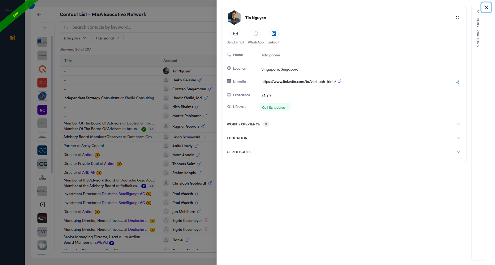
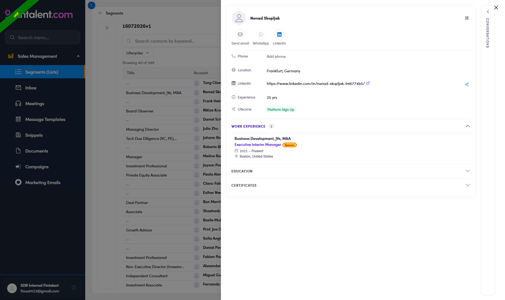
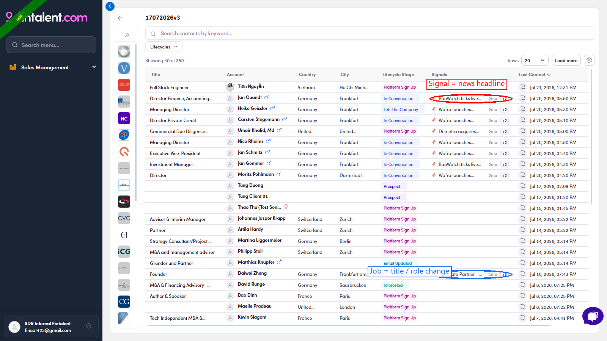
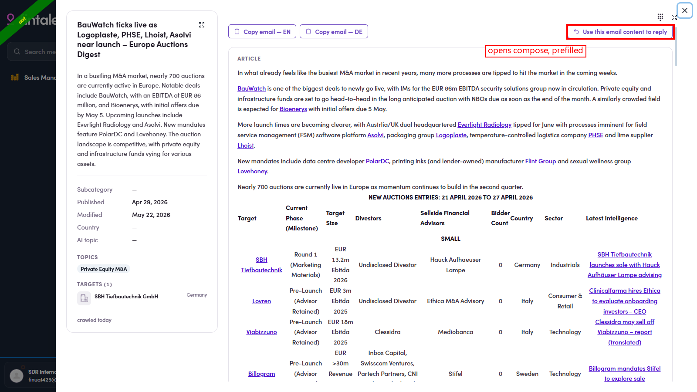
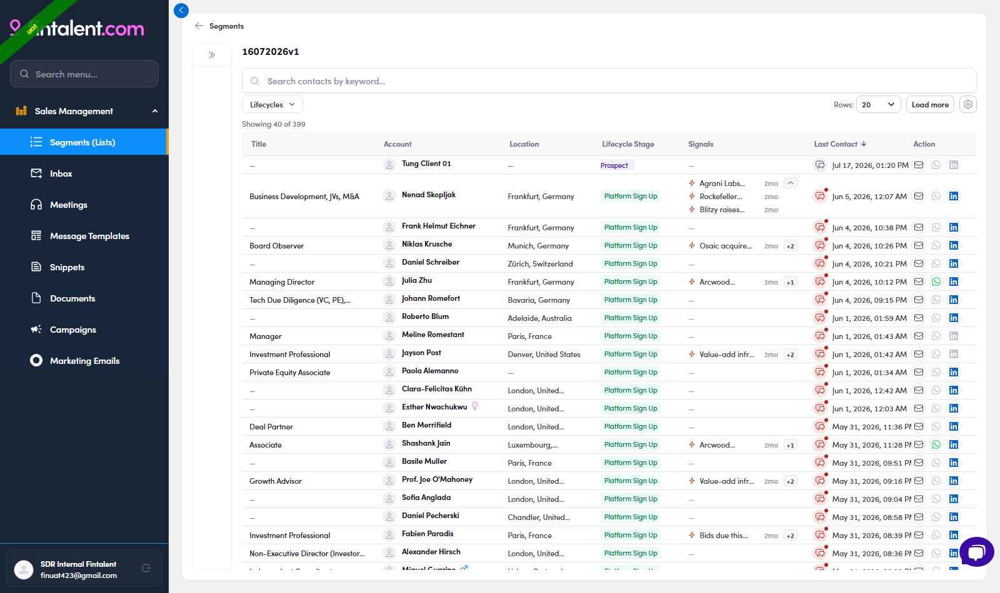

# 2.3 · Pick & read a contact

> 2 · Find a target contact

## 2.3

Click the **Account** (name) or the **Title** → the **profile drawer** opens: action bar **Send email, WhatsApp and LinkedIn**; facts (Phone, Location, LinkedIn, Experience, Lifecycle and Labels); collapsible **Work Experience, Education and Certificates**; the **Conversations** rail on the right edge.

*2.3: the profile drawer opens over the list: everything you need to decide and personalize.*

## 2.4 · Open Work Experience

(the number = how many roles) for their real role, firm and dates, your personalization goldmine.

*2.4: Work Experience expanded: roles + companies + dates.*

## 2.5 · Check Signals

a fresh reason to reach out. The **Signals** column has **two kinds**, and knowing which is which tells you how to open the conversation: "2mo" = how old the signal is; "+N" = more signals, click **+N** to expand them all. **Click a signal itself** → its **detail** opens (headline, source and date); for a **⚡ Signal (news)** it also carries a **ready email** you can send, see [Flow 3 · Way 4](3-send-a-1-1-email.md). Also glance at the **Conversations** rail (right edge). A teammate may already be talking to them. Now you're ready to classify (set its Lifecycle) or email (Flow 3).

- **⚡ Signal (news)**: a recent **event at the company** (a fund launch, an acquisition, a live auction, e.g. "BauWatch ticks live…", "Wafra launches fund…"). This is the type that can **draft an email for you**, see [Flow 3 · Way 4](3-send-a-1-1-email.md).

- **💼 Job (title / role change)**: a **person-level** change such as a new title or role (e.g. "Associate Partner – M&A…"). Good context for a personal note, but it does **not** pre-draft an email.

*2.5: the two signal types: ⚡ Signal = company news (red), 💼 Job = title/role change (blue).*

*2.5: click a signal → its detail opens: headline · source · date, plus Use this email content to reply / Copy email, EN / DE (⚡ Signal only).*

*2.5: "+N" clicked: every signal for the contact, each with its age.*
