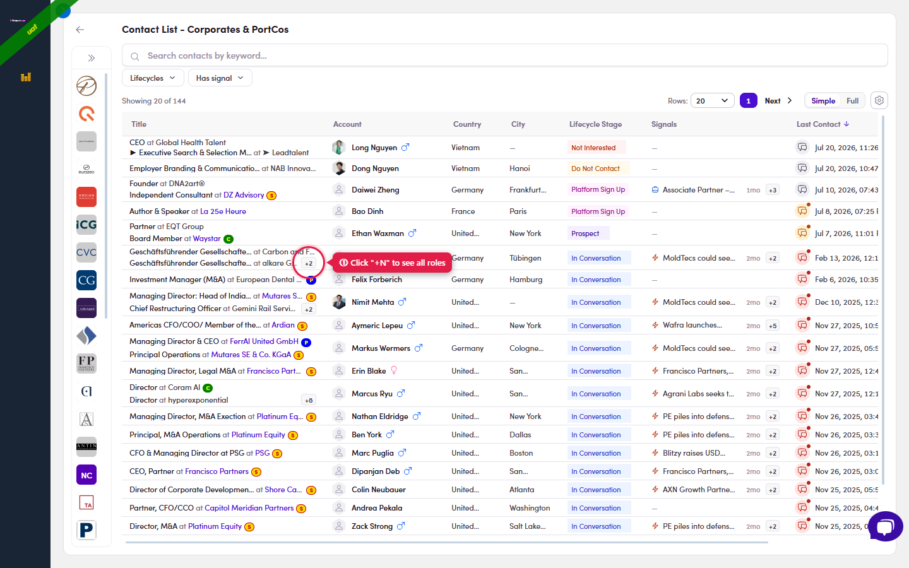
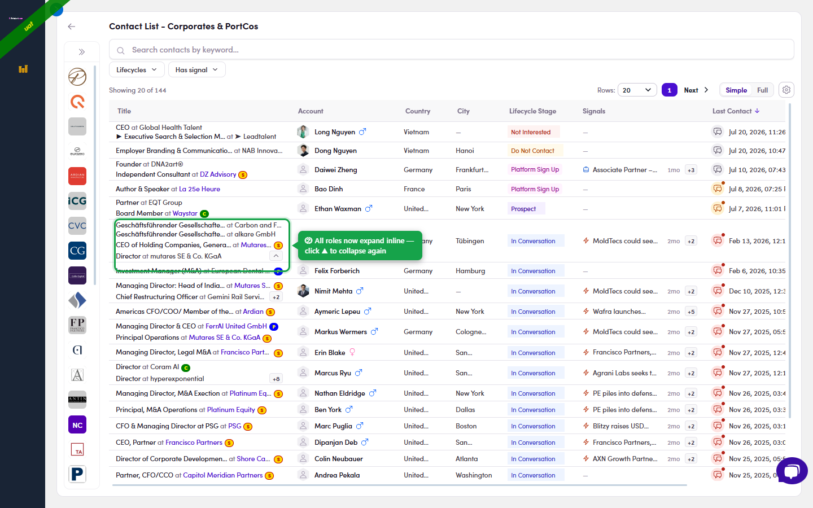

# 2.x.10 · "+N" more roles

> 2 · Find a target contact → 2.x · Edge cases

**"+N": a contact with several roles.** When someone holds more than two jobs, the extra ones are folded behind a small **"+N"** chip in the Title / Work Experiences cell. Click **+N** to expand every role inline (past & present); click the **▲** that appears to collapse them again. The same **+N** pattern in the **Signals** column hides extra signals, click it to see them all.

*2.x.10 · before: two roles shown; the +N chip hides the rest.*

*2.x.10 · after: click +N → all roles expand inline (click ▲ to collapse).*
