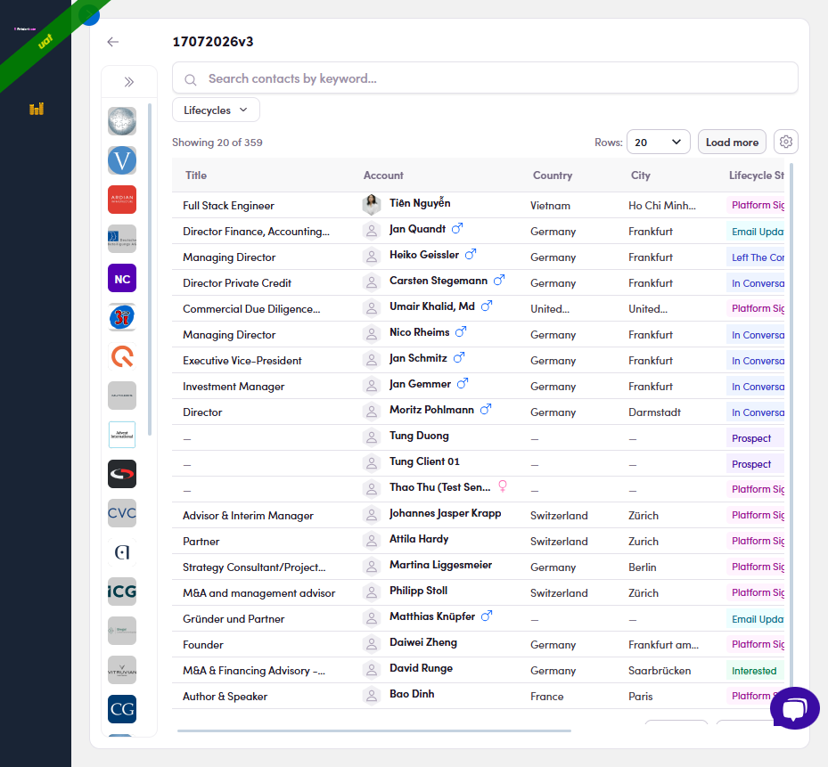
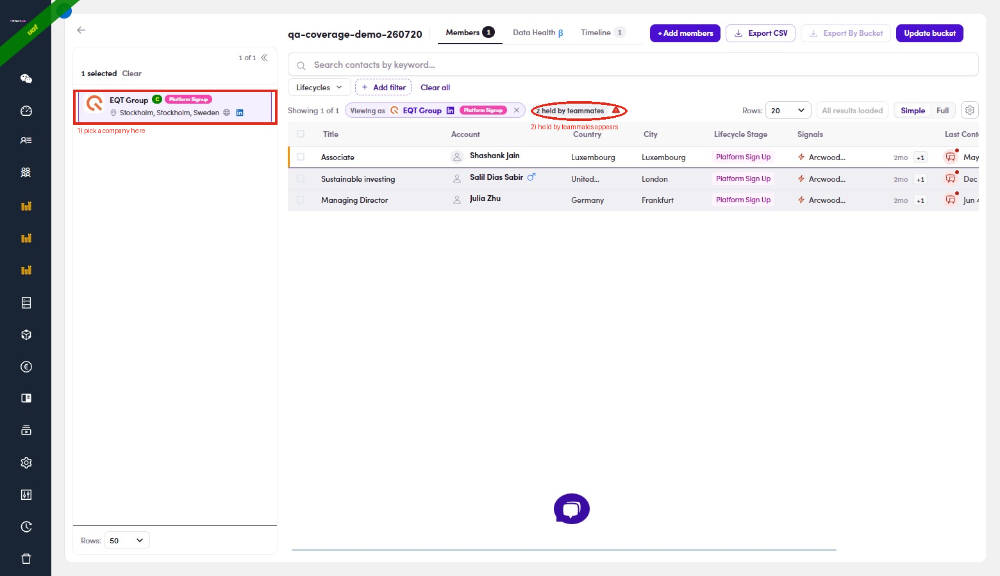

# 2.x.3 · Held by teammates

> 2 · Find a target contact → 2.x · Edge cases

**"Held by teammates" — check before you email.** **Why:** so two reps don't work the **same company** at once. If a firm already has someone at **Interested or higher** (Interested · Call Scheduled · Platform Sign Up · In Project · Project Completed), a teammate probably has a **live deal** there — emailing a *different* person makes the firm hear two Fintalent voices and can hurt that deal. **How:** open your list → expand the company rail (**»**) → **click a company** (①). The table then splits in two: (People at Prospect / In Conversation, or in no list, aren't shown — a cold touch isn't a collision.)

- **White rows = yours** — contacts in your list; work them normally (never shown twice).

- **Gray rows = held by a teammate** — not in your list but in a teammate's at a hot stage; a **"N held by teammates"** pill shows the count (②). **Don't email them** — hover the **⚠** to see who holds whom, then align with that teammate first.

*2.x.3 · step — the left company rail is collapsed to logos only by default; click the » toggle at its top to expand it.*

*2.x.3 · result — ① pick a company → ② the "N held by teammates" pill + gray rows (Case 2).*
