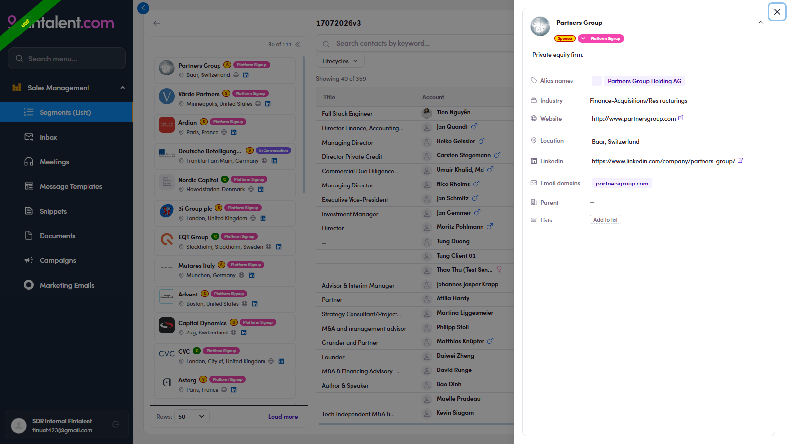

# 2.x.4 · View company detail

> 2 · Find a target contact → 2.x · Edge cases

**View a company's detail.** In the left company rail, **click the company name** (highlighted in the image) → its **detail drawer** opens on the right with the firm's profile. Use it to sanity-check a firm before working its people. Each field:

| Field | What it shows |
|---|---|
| **Name + logo** | The company name, with status chips (e.g. **Sponsor** · **In Conversation**). |
| **Description** | One-line summary of the firm — sector, size, region (e.g. "PE firm, EUR 50–250m enterprise value, DACH"). |
| **Alias names** | Other names / spellings the firm is also known by. |
| **Industry** | The firm's industry classification. |
| **Website** | Company website — opens in a new tab. |
| **Location** | HQ city & country. |
| **LinkedIn** | The company's LinkedIn page — opens in a new tab. |
| **Email domains** | The firm's email domains (e.g. dbag.com, dbag.de) — handy to sanity-check a contact's email address. |
| **Parent** | Parent company, if any (— when there's none). |

*2.x.4 — click the company name in the left rail (highlighted) → the company detail drawer opens on the right.*
