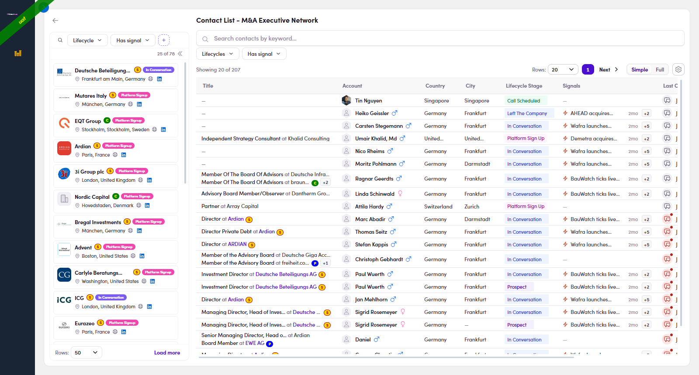

# 2.x.6 · Has signal (2 levels)

> 2 · Find a target contact → 2.x · Edge cases

**Filter by Has signal (two levels).** Besides **Lifecycles** (2.x.1), the members bar carries a **Has signal** filter — so the bar over your contacts is **Lifecycles · Has signal**, and the company rail has its own. It's the same word at two levels: Same dropdown tool as Lifecycles: ✓ include / ✕ exclude, Has/No radios, Paste list. [Full company-rail reference → Flow 8.2 ↗](8-2-list-company-rail.md)

- **Members bar** (right, over contacts) → **Has signal : Yes** keeps **people who personally have a signal**; the **Signals** column then has a value on every row (⚡ news / 💼 job). E.g. 359 → 246.

- **Company rail** (left, over firms) → expand it (**»**) and its bar shows **Lifecycle · Has signal** (+ 🔍 search). **Has signal : Yes** keeps **firms that have a signal** — the best ones to open with. E.g. 111 → 29.

*2.x.6 — members bar = Lifecycles · Has signal; company rail = Lifecycle · Has signal (+ 🔍 search).*
