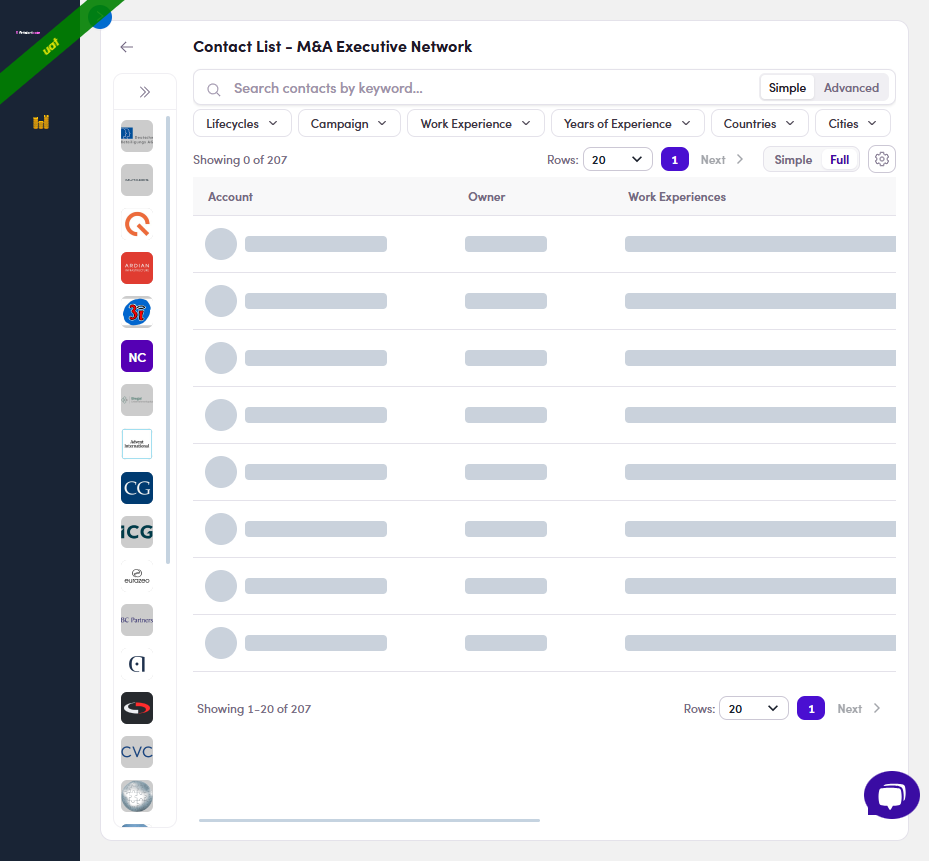

# 2.x.9 · Still loading (0 of N)

> 2 · Find a target contact → 2.x · Edge cases

**"Showing 0 of N" — the list is still loading.** A count of **0** with grey skeleton rows just means the members are still fetching (can lag a moment on big lists). Wait a beat — it fills in.

*2.x.9 — Showing 0 of N + grey skeleton rows = still loading; it populates in a moment.*
