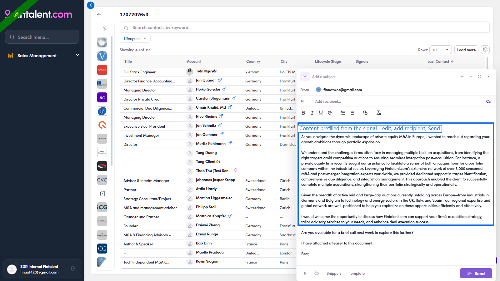

# 3.1 · 3 ways into compose

> 3 · Send a 1:1 email

4.1.1Way 1 — From the list row (fastest)

1. **1a** — **Segments (Lists)** → open your list → find the contact's row.

2. **1b** — In the **Action** column (right side) click the **✉ icon** → compose opens for that contact, without leaving the list.

   

   *Way 1 — click the ✉ icon in the row's Action column (far right, circled) → compose opens for that contact.*

4.1.2Way 2 — From the contact's profile

1. **2a** — **Open the contact** (click the name/title) → the profile drawer opens.

2. **2b** — In the action bar at the top click **Send email** → compose opens.

   

   *Way 2 — the Send email button in the profile action bar (top-left of the drawer).*

4.1.3Way 3 — From the Conversations rail (see history first)

1. **3a** — **Open the contact** → on the right edge click the vertical **CONVERSATIONS** tab to expand the rail.

2. **3b** — In the rail click **New Email** → compose opens, with the existing thread history right there.

   

   *Way 3 — the Conversations rail: thread list + New Email (and ↩ reply arrows).*

4.1.4Way 4 — From a signal (email already drafted for you)

1. **4a** — **Segments (Lists)** → open your list → look at the **Signals** column → click a signal on the contact's row → the **signal detail** opens. (What the two signal types mean → [Flow 2 · Signals column](2-find-a-target-contact.md).)

   

   *The Signals column — click a signal to open its detail.*

2. **4b** — In the signal detail, top-right, click **Use this email content to reply**.

   

   *Use this email content to reply (circled) — or Copy email — EN / DE if you only want the text.*

3. **4c** — Compose opens with the **body already written** from the signal. **To** is empty — add the contact → check From / Subject → personalise the draft → **Send** (finish at 4.2 below).

   

   *Compose prefilled from the signal — a ready draft you edit, address, and send.*

Replying to someone who already wrote to you is a separate job — see [Flow 4 · Answer replies](4-view-replies-and-answer-replies.md).

## In this step

* [3.1.1 · List row ✉](3-1-1-list-row.md)
* [3.1.2 · Profile Send email](3-1-2-profile-send-email.md)
* [3.1.3 · Conversations → New Email](3-1-3-conversations-new-email.md)
* [3.1.4 · From a signal](3-1-4-from-a-signal.md)
