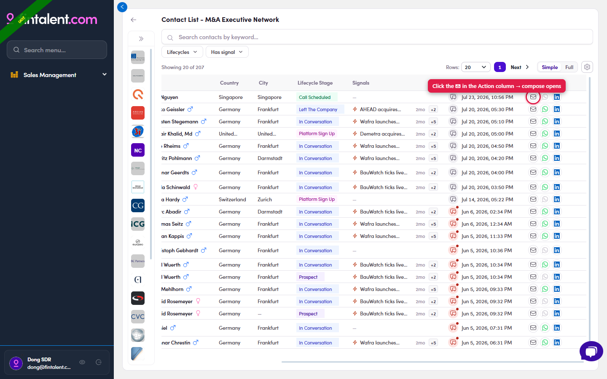
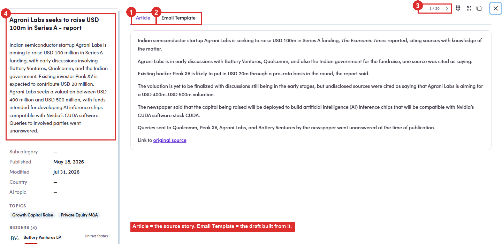
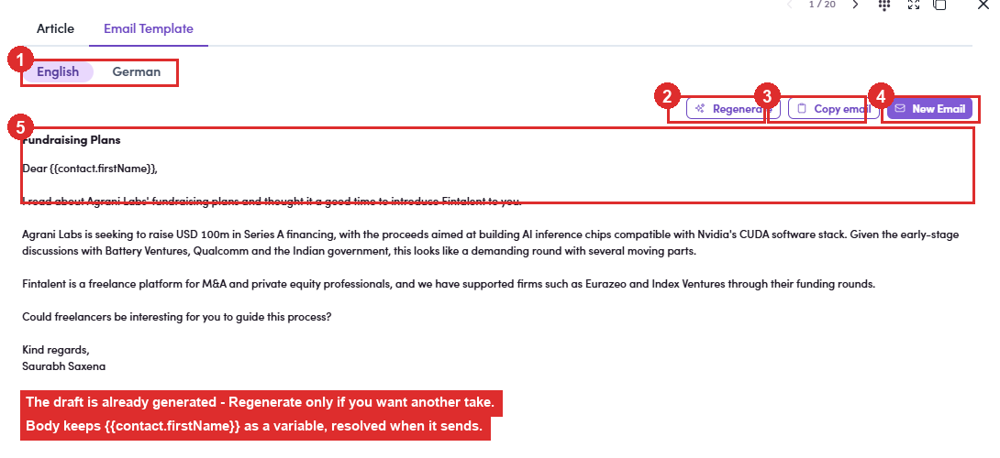
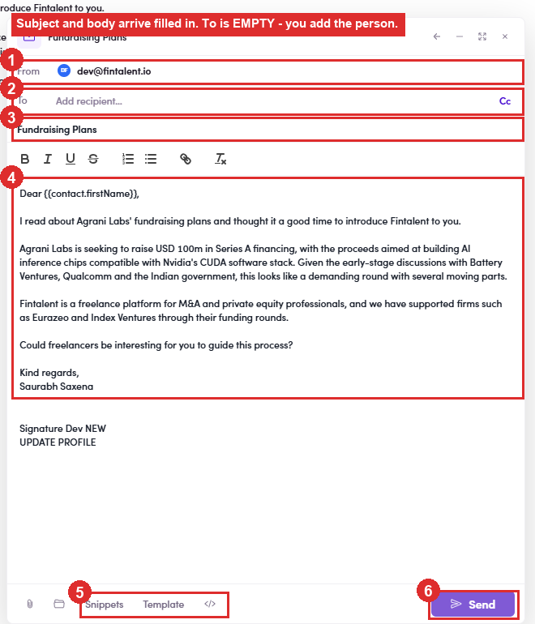

# 3.1 · Four ways into compose

> 3 · Send a 1:1 email

3.1.1Way 1: From the list row (fastest)

1. **1a** — **Segments (Lists)** → open your list → find the contact's row.

2. **1b** — In the **Action** column (right side) click the **✉ icon** → compose opens for that contact, without leaving the list.

   

   *Way 1: click the ✉ icon in the row's Action column (far right, circled) → compose opens for that contact.*

3.1.2Way 2: From the contact's profile

1. **2a** — **Open the contact** (click the name/title) → the profile drawer opens.

2. **2b** — In the action bar at the top click **Send email** → compose opens.

   

   *Way 2: the Send email button in the profile action bar (top-left of the drawer).*

3.1.3Way 3: From the Conversations rail (see history first)

1. **3a** — **Open the contact** → on the right edge click the vertical **CONVERSATIONS** tab to expand the rail.

2. **3b** — In the rail click **New Email** → compose opens, with the existing thread history right there.

   

   *Way 3: the Conversations rail: thread list + New Email (and ↩ reply arrows).*

3.1.4Way 4: From a signal (the draft is written before you arrive)

What this way is forA signal is a piece of news, a raise, a carve-out, an appointment. Fintalent turns it into a **ready-written email about that news**, so instead of starting from a blank window you start from a draft that already references what happened. Your job is to pick who it goes to and make it sound like you.

1. **3.1.4a** — **Two ways to reach a signal.** The Signals column is off until you switch it onOut of the box the contact list shows **7 of 10** available columns and **Signals is not one of them**, Title, Account, Country, City, Lifecycle Stage, Last Contact and Action. Add it from the **⚙ Column settings** gear at the right of the filter bar, where **Signals** sits in the list. **🐛 Do not use the search box in that panel to find it.** Typing *signal* returns an **empty list** even though the column is there, scroll the list instead. Reproduced every time. **Simple / Full are two different presets**, each with its own column set. **Full** does *not* include Signals either (it swaps in Owner, Work Experiences, Additional Emails, Campaign, Marketing Email), so switching preset is not a shortcut to getting the column.

   | From | How |
   |---|---|
   | **A contact you are working** | **Contacts** → the **Signals** column on their row → click the signal. Best when you already have a person in mind. |
   | **The news itself** | **Signals** in the left menu → click any row. Best when you are hunting for a reason to reach out. |

2. **3.1.4b** — **Read the signal before you use it.** The detail opens as a panel: on the left the **story** and its facts, **Subcategory, Published, Modified, Country and AI topic**, then **TOPICS**, **BIDDERS** (with a **Sponsor** chip where it applies) and **TARGETS**. On the right, two tabs: **Article** and **Email Template**. **Article** is the source story in full, ending in a **Link to original source**. Read it: the draft on the other tab is only as good as your grasp of what actually happened. The **1 / 20** pager top-right walks you through the other signals without closing the panel.

   

   *3.1.4b: ① Article, the source story · ② Email Template, the draft built from it · ③ the 1 / 20 pager · ④ the facts panel: topics, bidders, targets.*

3. **3.1.4c** — **Email Template: the draft is already there.** Nothing to press to make it appear. Across the top: an **English / German** switch; on the right three actions: The body keeps `{{contact.firstName}}` as a **variable**, not a name, it resolves when the email goes out, which is why it still looks like that in the draft ([3.x.1 ↗](3-x-1-templates-use-and-create.md)).

   | Button | What it does |
   |---|---|
   | **Regenerate** | throws the current draft away and writes another. Use it when the angle is wrong, not to fix a word. You can edit freely once it is in compose. |
   | **Copy email** | copies the text only. For when you want it somewhere other than Fintalent. |
   | **New Email** | the one you want: opens compose with the draft already in it. |

   

   *3.1.4c: ① English / German · ② Regenerate · ③ Copy email · ④ New Email · ⑤ the draft, already written, with the merge variable intact.*

4. **3.1.4d** — **New Email → compose opens carrying the draft.** The window arrives with **From** set to your mailbox, the **subject** filled in from the signal (*Fundraising Plans*), the **body** written out in full and **your signature** appended. The bottom bar has the usual **📎 attach, Snippets, Template and </>** and **Send**. ⚠ To is empty: that is the one thing it cannot guessComing in from the **Signals** page there is no contact attached, so **To** arrives blank and you add the person yourself. Coming in from a contact's **Signals** column the person is already known, but **check the field before you send either way**: a draft this complete makes it easy to hit Send on an email addressed to nobody, or to the wrong person. From here it is the ordinary compose window, finish at [3.2 ↗](3-2-compose-and-send.md). **Edit it before you send.** The draft names the deal correctly but it is written by a machine; a sentence in your own words is what stops it reading like a circular.

   

   *3.1.4d: ① From, your mailbox · ② To, empty · ③ subject, filled · ④ body, filled · ⑤ Snippets / Template · ⑥ Send.*

**Not yet covered:** the same trick starting from **Job Search**, not walked, so nothing is claimed about it here.

Replying to someone who already wrote to you is a separate job, see [Flow 4 · Answer replies](4-view-replies-and-answer-replies.md).

## In this step

* [3.1.1 · List row ✉](3-1-1-list-row.md)
* [3.1.2 · Profile Send email](3-1-2-profile-send-email.md)
* [3.1.3 · Conversations → New Email](3-1-3-conversations-new-email.md)
* [3.1.4 · From a signal](3-1-4-from-a-signal.md)
