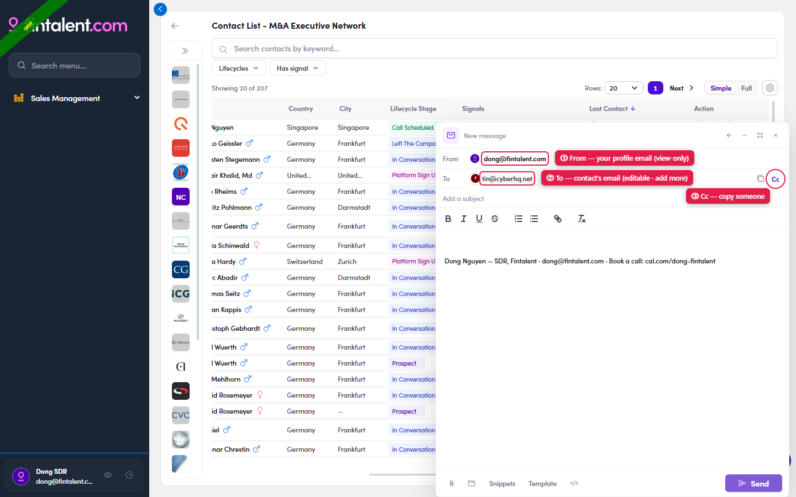
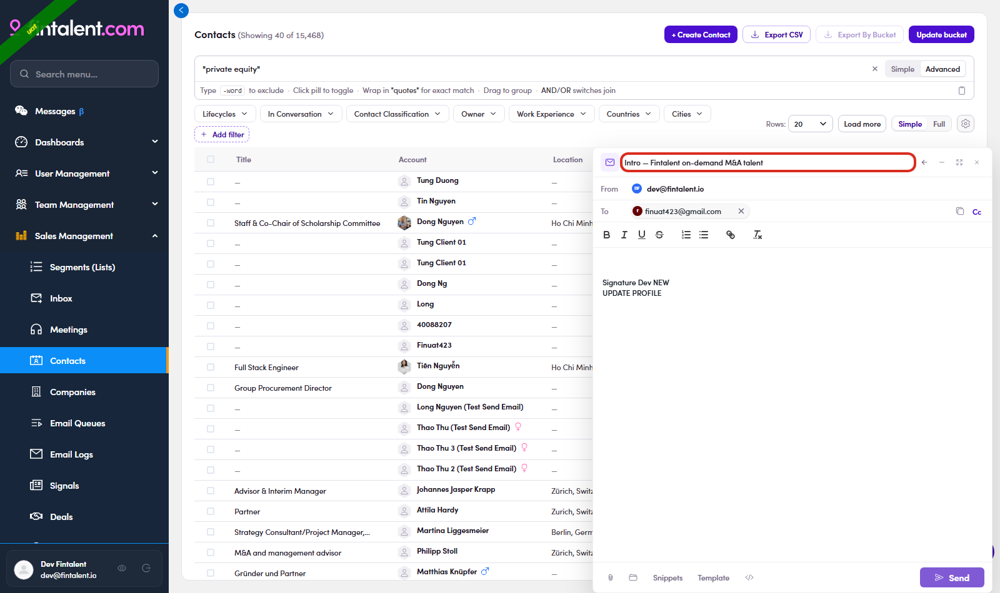
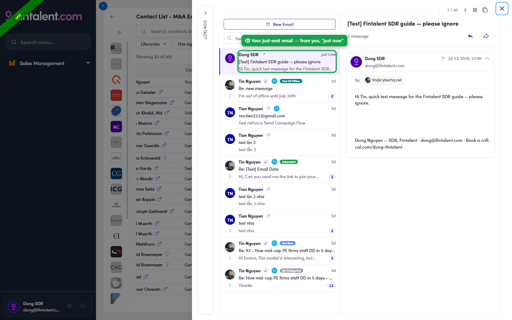

# 3.2 · Compose & send

> 3 · Send a 1:1 email

The whole job here is to **send a good email successfully** — 4 steps:

1. **3.1** — **Check From / To / Cc.** Both address fields are pre-filled — check them before sending:

   - **From** = **your own mailbox**, filled in automatically from the email set up on your **SDR profile**. You can't change it in compose — it's set by your Admin (you only view it → [Flow 1 · your account ↗](1-x-3-where-i-can-open-my-account.md)).

   - **To** = the **contact's email**, pre-filled from the person you started from. You **can** change it or add **extra recipients** — type an email and press **Enter** (each becomes a chip; the **✕** removes it).

   - **Cc** = copy someone else: click **Cc** at the right of the To row → a Cc field appears → type their email and press **Enter**.

   

   *3.1 — ① From = your profile email (view-only) · ② To = the contact's email (editable, add more) · ③ Cc = copy someone in.*

2. **3.2** — **Type the Subject yourself** in "Add a subject" at the very top. For a **new** email it starts empty and does **not** auto-fill, even from a Template (known bug). The Send button blocks an empty subject — so you can't forget.

   

   *3.2 — the subject box (red frame) — type it yourself.*

3. **3.3** — **Write your message** in the body (personalize with their role & signal from Flow 2). Want to start from a Template, drop in a Snippet, or attach a file? See Edge cases (3.x).

4. **3.4** — Proofread → **Send**. It auto-logs into Conversations, your **signature** (Flow 1.x.5) is appended automatically, and there is **no recall**.

5. **3.5** — **See your sent email.** The moment you send, your email is logged to the contact's **Conversations**. There are **two ways** to open it — both land on the **same Conversation**: The left pane lists every message; click yours to read it on the right (From = you, To = the contact, plus your signature).

   - **From the list** — click the contact's **💬 conversation** icon (Last Contact column) → the Conversations drawer opens with your email at the **top** of the thread, marked **"just now"**, sent by you.

   - **From the contact** — open the contact and switch to the **Conversations** tab.

   

   *3.5 — your just-sent email sits at the top of Conversations ("just now"); the right pane shows it in full.*
