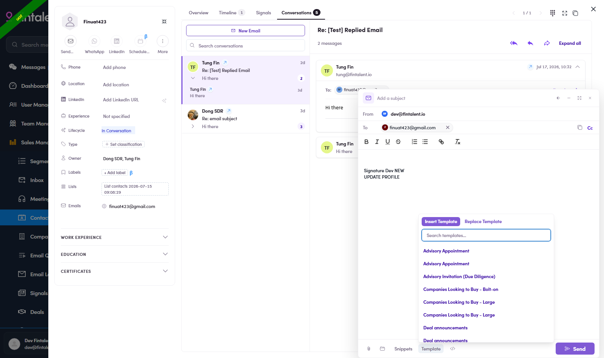
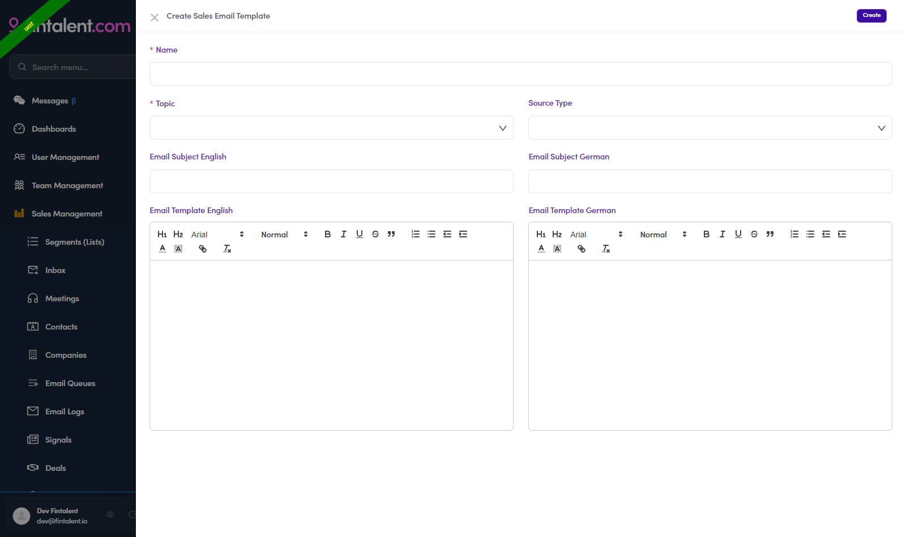

# 3.x.1 · Templates (use & create)

> 3 · Send a 1:1 email → 3.x · Edge cases

## use · Use it in compose

click **Template** in the compose bar → *Insert* appends to your draft, *Replace* overwrites it (incl. the EN 01–05 set). Even from a Template the subject box still needs typing (3.2 bug).

*Use: Template: Insert / Replace + search.*

## make · Build your own

**Message Templates** (left menu) → **+ Create New** → fill **Name*** (how it shows in compose, e.g. `EN 06 - Follow-up`), **Topic***, **Source Type**, **Subject EN / DE** and **body EN / DE** (two rich-text editors) → **Create**. Edit/delete via row actions; filter by Topics.

*Create: Name\* · Topic\* · Subject EN/DE · rich-text body EN/DE.*
