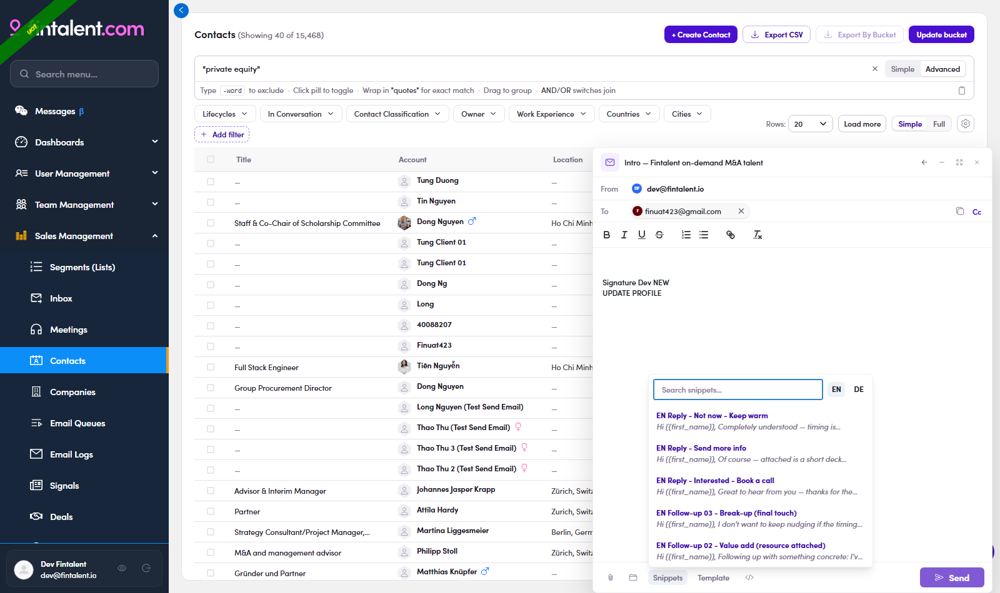
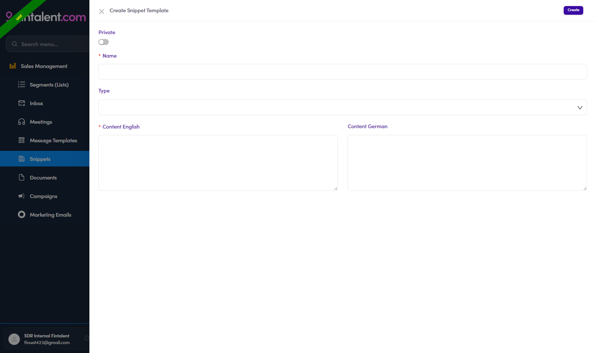

# 3.x.2 · Snippets (use & create)

> 3 · Send a 1:1 email → 3.x · Edge cases

1. **use** — **Use it in compose:** click **Snippets** → search → click = inserted at the cursor (EN | DE toggle).

   

   *Use — Snippets: search + EN/DE, insert at cursor.*

2. **make** — **Build your own:** **Snippets** (left menu) → **+ Create New** → **Private** toggle (**ON = only you**; OFF = shared) · **Name*** · **Type** · **Content English*** / **Content German** → **Create**. Edit/delete by hovering the row.

   

   *Create — Private toggle · Name\* · Type · Content EN\*/DE.*
