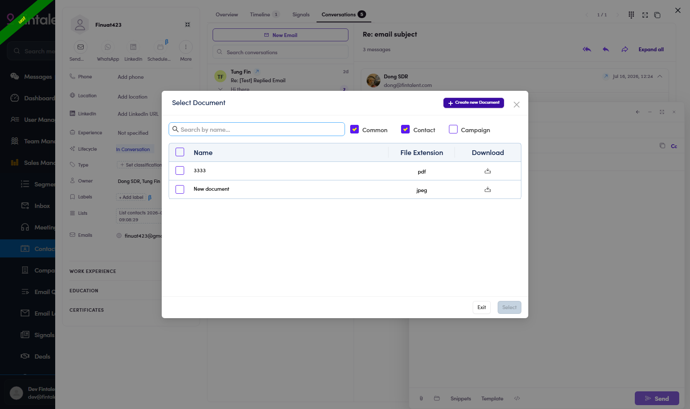
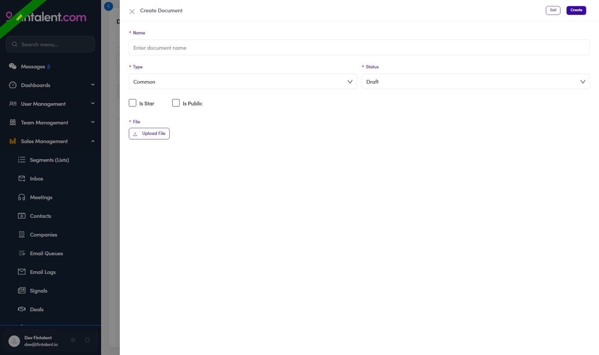

# 3.x.3 · Documents & files

> 3 · Send a 1:1 email → 3.x · Edge cases

## use · Use it in compose

**📎** uploads a file from your computer; **🗂** attaches from the shared Document library (Common · Contact · Campaign filter checkboxes, **Published** files only).

*Use — 🗂 Select Documents: shared files (Published only).*

## make · Build the library

**Documents** (left menu) → **+ Create New** → **Name*** · **Type*** (Common / Contact / Campaign — the compose tab it lands under) · **Status*** (**Draft** → **Published**; only Published is attachable) · **Is Star** · **Is Public** · **File*** → **Upload File** → **Create**. Retire with **Archived**, not delete.

*Create — Name\* · Type\* · Status\* (Draft→Published) · Upload File.*
