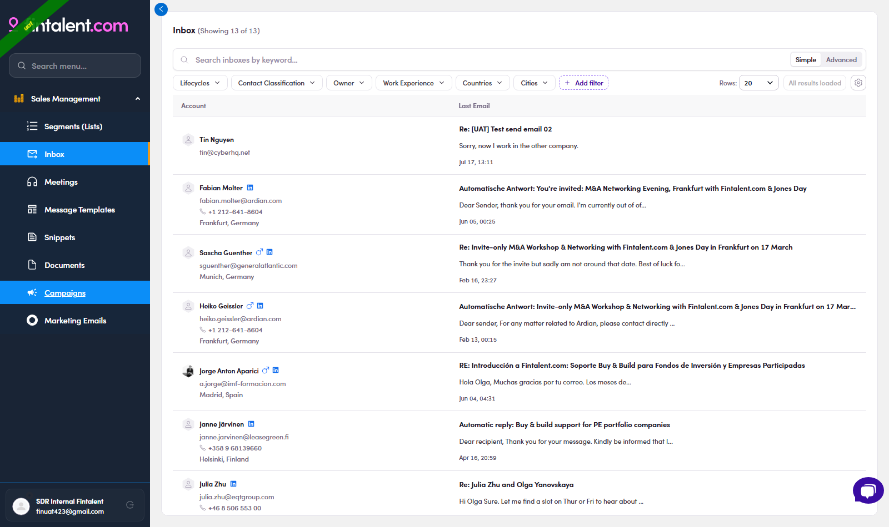
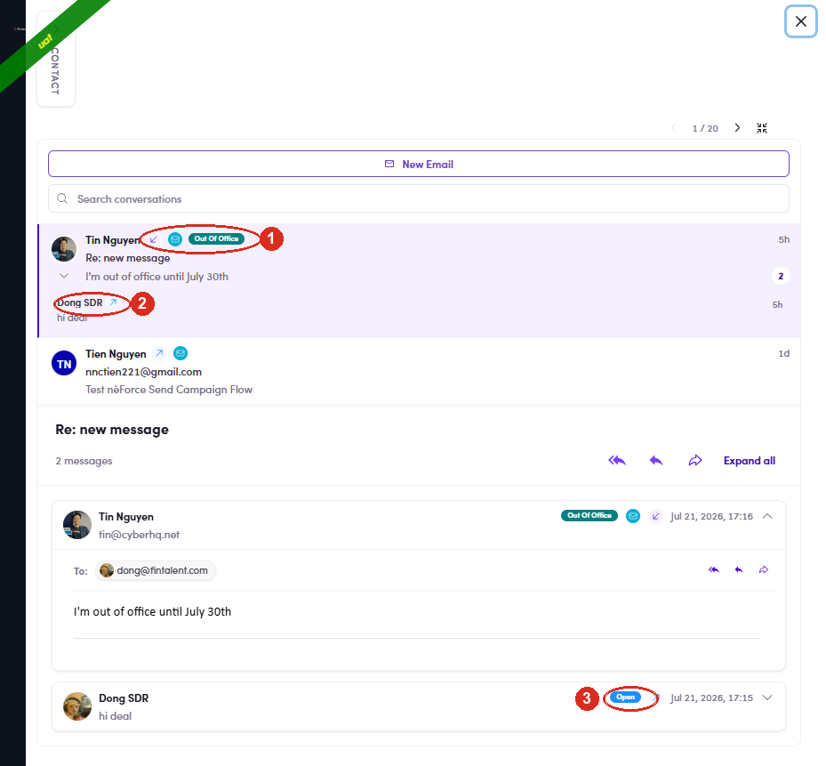
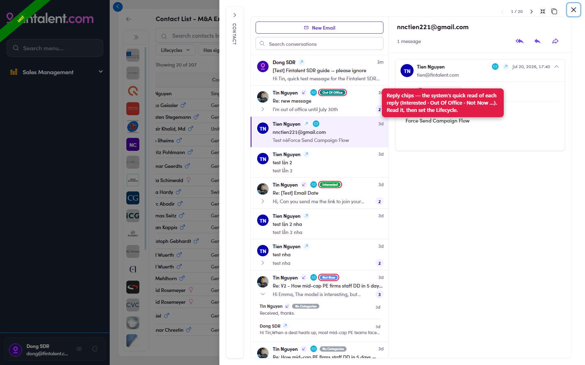
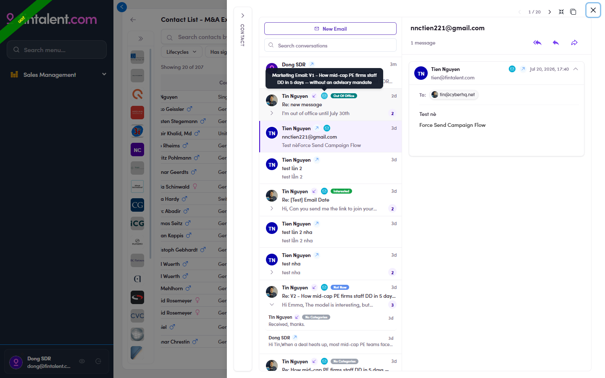
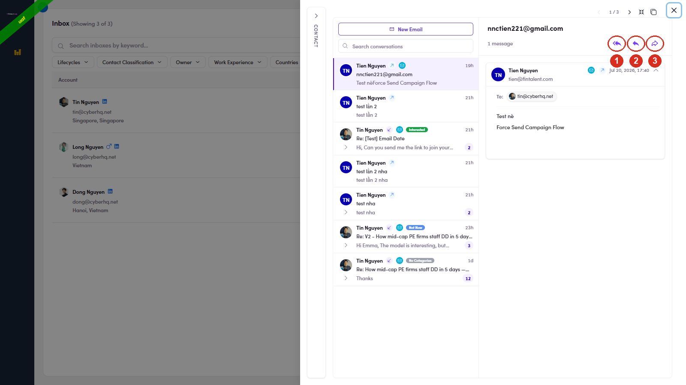
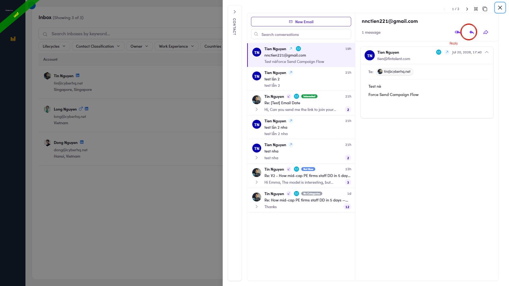
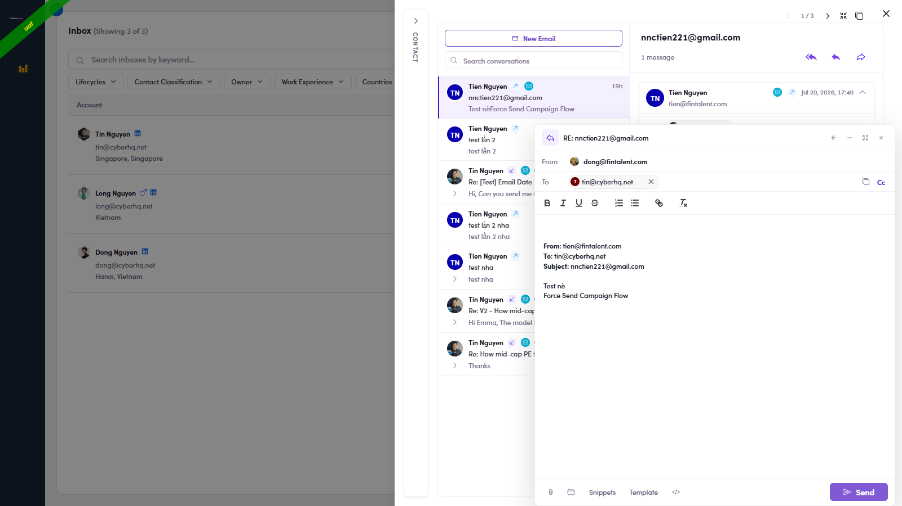

# 4.1 · View & answer a reply

> 4 · View replies & answer replies

1. **4.1** — **Open the replies**: click **Inbox** in the left menu — one row per contact who wrote back (auto-replies / OOO land here too). Each row has two columns:

   - **Account** — who it's from: avatar, **name**, email address, phone, and city / country.

   - **Last Email** — the most recent message in that thread, shown in three parts: **Subject** (bold, top line) — the email's subject (e.g. "Re: How mid-cap PE firms staff DD in 5 days"). **Preview** (grey, middle) — the opening line of the body, so you can triage without opening it. **Date** (bottom) — when it arrived (e.g. "Jul 17, 13:11").

   

   *4.1 — Inbox: one row per reply (Account | Last Email).*

2. **4.2** — **Spot which messages are replies — and glance at the auto chip.** The clearest signal is the **direction arrow** next to the sender in the thread: Each message also shows an **auto chip** the system assigns from the content: the prospect's replies get a meaningful one (**Out Of Office · Interested · Not Interested · Call Scheduled…**), while your own **sent** emails carry a **delivery-status** chip (below). Read any chip as a hint only — you can't edit it and it doesn't change the contact's lifecycle by itself; use the **arrow** (not the chip) to tell a reply from a send.

   - **↙ inbound arrow + the contact's name** = **a reply from the prospect** (their words) — the message to read and answer.

   - **↗ outbound arrow + your own name** = **an email you sent** (e.g. "Dong SDR ↗").

   | Chip | On | What it means | Your move |
   |---|---|---|---|
   | Delivered | your send | Sent & delivered — the prospect hasn't opened it yet. | Give it time, then follow up. |
   | Open | your send | The prospect **opened** your email (or it isn't classified yet). | Warm signal — worth a follow-up. |
   | ⚠ Dropped | your send | **The email did NOT go out** — it failed to send. | **Send it again** — this one needs your attention. |
   | Interested Call Scheduled | their reply | The system read the reply as a positive signal. | Read it, then set the contact's Lifecycle. |
   | Out Of Office Not Interested … | their reply | The system's quick read of what they wrote. | Read it, then set the Lifecycle. |

   

   *4.2 — ① a reply = ↙ inbound arrow + a real chip ("Out Of Office"); ② your send = ↗ outbound arrow + your name; ③ your send's chip = a delivery status (Delivered · Open · ⚠️ Dropped).*

   

   *4.2 · chips — the coloured reply chips down the thread list: Out Of Office · Interested · Not Now — the system's quick read of each reply. (Your own sent rows instead carry a delivery-status chip — Delivered · Open · ⚠️ Dropped.)*

3. **4.3** — **Read the email — and know where it came from.** Click any row → the contact opens on **Conversations**: the **thread list** is on the left, the **selected message** on the right. **Expand all** unfolds the whole exchange. Read what they actually wrote — the chip is only a hint. **What a "thread" is:** one **conversation** = every email exchanged with that contact under one subject, grouped together. Each item in the left list is a thread; a small **count badge** (e.g. **2 · 3 · 12**) shows how many messages it holds. Click to open it, then use the **›** / **Expand** chevron to unfold every message in order. **Anatomy of a thread row** (left list): **Where a sent email came from** — **Campaign** and **Marketing Email** use the **same small ✉ badge**, so you **hover it** to tell them apart (the tooltip spells out which). A **Direct** 1:1 send has **no badge** at all: Reply vs no replyA thread with an **inbound** message means the prospect **wrote back** — answer it (4.4 / 4.5). A thread that's only your own **↗ sends** has **no reply yet** — that's a follow-up candidate ([Flow 5 ↗](5-follow-up-on-silent-prospects.md)).

   - **Avatar + name** — who the latest message is from.

   - **Direction arrow** — **↗** = an email **you sent** (e.g. "Dong SDR ↗"); the prospect's name with no outbound arrow = **their reply**.

   - **Source icon** (small ✉) — hover it to see where a **sent** email came from (see the table). A **reply** has none.

   - **Auto chip** — the system's read (Out Of Office · Interested · Not Now …) → see [4.2](4-1-view-and-answer-a-reply.md).

   - **Count badge** = messages in the thread · **Date** = when the latest one arrived.

   | Source | What it means | How to tell |
   |---|---|---|
   | **Direct** | You wrote & sent it yourself, 1:1 (Flow 3). | **↗ your name**, **no** source icon. |
   | **Campaign** | Sent by an automated **campaign** sequence the contact is enrolled in. | Source icon → tooltip **"Campaign: [name]"**. |
   | **Marketing Email** | Sent as part of a **marketing email** send. | Source icon → tooltip **"Marketing Email: [name]"**. |

   

   *4.3 — hover the ✉ source icon on a sent email → the tooltip names where it came from (here Marketing Email: V1 …). Direct 1:1 sends show no source icon; campaign sends read "Campaign: …".*

   

   *4.3 · actions — the three action arrows sit at the top-right of the open message: ① Reply all · ② Reply · ③ Forward.*

4. **4.4** — **Decide: reply or not.** If it needs an answer, reply (4.5). If it doesn't (e.g. a plain "not interested" or an auto-reply), skip replying and just **classify the contact** (Flow 3) so it leaves the queue.

5. **4.5** — **Click Reply** — the **single ↩ arrow** at the **top-right of the open message** (circled below). It answers **only the person who wrote** — the normal choice for 1:1 outreach. The **subject auto-fills** as **RE: [the original subject]** (you can still edit it). (The double-arrow **Reply all** and the **Forward** arrow sit right next to it — see Edge cases.)

   

   *4.5 — the Reply button (single arrow) at the top-right of the message.*

6. **4.6** — **What opens:** a **compose window** with the subject already set to *RE: …*, the **sender pre-filled in To**, and the original message quoted below. It stays in the **same thread**.

   

   *4.6 — Reply clicked: \*RE:\* subject, the sender in To, the quoted original.*

7. **4.7** — **Write your message → Send.**
