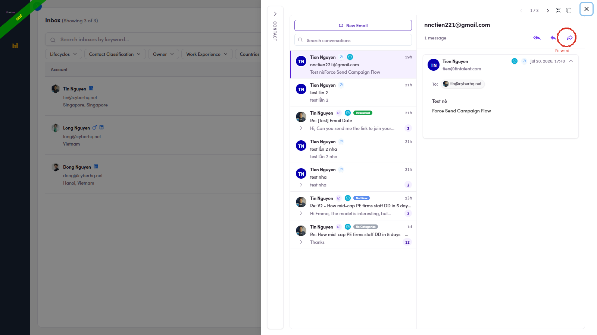

# 4.x.2 · Forward

> 4 · View replies & answer replies → 4.x · Edge cases

**Forward** — the **➡ arrow** (right of Reply, circled below) sends this message on to **someone new**. Same window, but **To starts empty** for you to type the new recipient; the original message is carried in the body. The **subject auto-fills** as **FW: [original subject]**.

*4.x.2 — the Forward button (arrow pointing right), rightmost of the three.*
