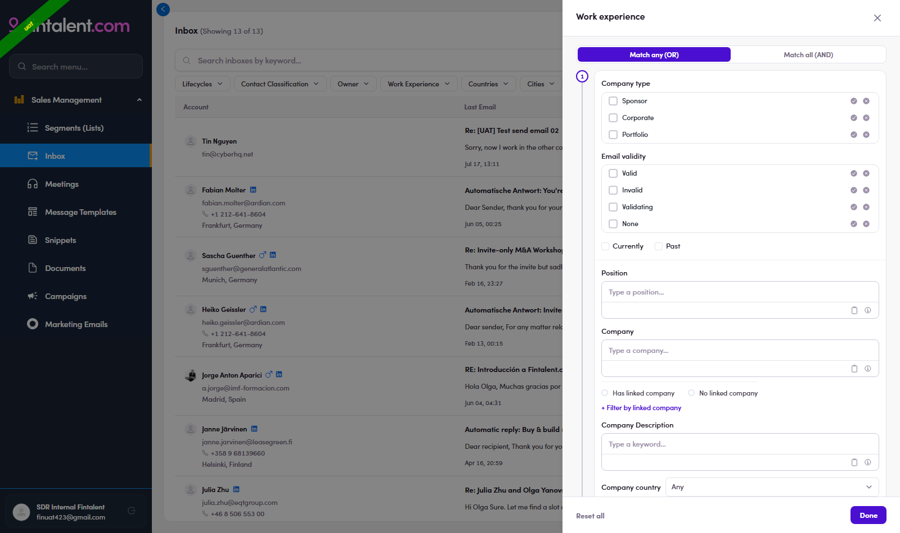

# 4.x.3 · Filters

> 4 · View replies & answer replies → 4.x · Edge cases

**Filters.** The Inbox bar carries the full set; **+ Add filter** opens **Customize Quick Filters** (pin filters, Reset defaults) to build your own quick bar. Use it to slice big queues (only DACH, only CFOs). [Full Inbox-filter reference → Flow 8.3 ↗](8-3-inbox-filters.md) Every dropdown works the same: each value has a **✓ include** (keep only these) / **✕ exclude** (hide these); **Has / No …** radios catch records with/without any value; **Paste list** takes one value per line; several ✓ together = **OR**. **Work Experience** filters by **career**, not just the contact record. A top **Match any (OR)** / **Match all (AND)** toggle decides whether a person must meet one or all of: **Company type** (Sponsor · Corporate · Portfolio) · **Email validity** (Valid · Invalid · Validating · None) · **Currently / Past** · **Position** (job title) · **Company** (or Has / No linked company, plus **+ Filter by linked company**: city · country · bucket · classification) · **Company Description** · **Company country / city**. E.g. Work Experience → Company type = Sponsor took a 27-reply queue to **25** (every remaining row a sponsor firm).

| Filter | What it narrows · how to use |
|---|---|
| **Lifecycles** | by contact stage — same ✓/✕ tool as 2.x.1 |
| **Contact Classification** | contact **type**: **Talent · Client · Other** (each ✓/✕; Has/No radios + Paste list) |
| **Owner** | which teammate owns the contact — pick yourself to see only yours |
| **Work Experience** | career facts — the power filter (fields below) |
| **Countries · Cities** | the contact's location — pick a geography (DACH, UK…) |
| **+ Add filter** | **Customize Quick Filters** — pin/unpin which filters show on the bar (Reset defaults) |

*4.x.3 — the Work Experience filter inside Inbox; + Add filter pins more.*

*4.x.3 · panel — the full Work Experience panel: Match any/all · Company type · Email validity · Currently/Past · Position · Company/linked · Description · country/city.*
