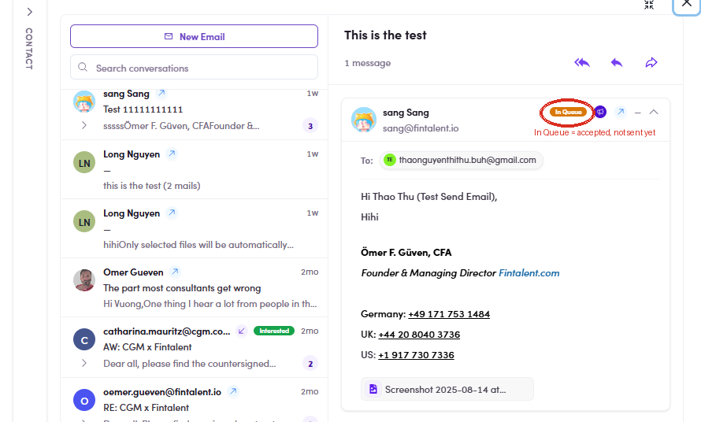

# 4.x.4 · "In Queue" tag

> 4 · View replies & answer replies → 4.x · Edge cases

**The orange "In Queue" tag.** A message tagged **In Queue** is accepted but **not sent yet** (waiting in the send queue). It clears to a normal sent message once it goes out — it just means "on its way", **don't re-send**.

*4.x.4 — the orange In Queue tag on a message (circled): accepted, waiting in the send queue, not sent yet.*
