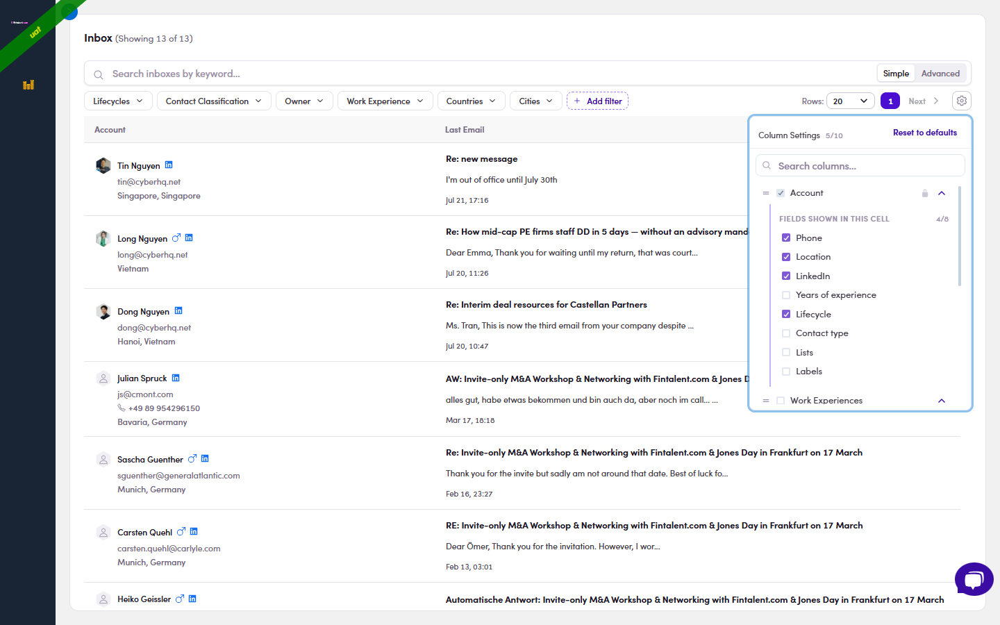

# 4.x.5 · Show / hide columns

> 4 · View replies & answer replies → 4.x · Edge cases

**Show / hide columns.** The **gear ⚙** (top-right, next to Simple / Full) opens **Column Settings**, tick the columns you want in the Inbox, untick the rest (search the list, or **Reset to defaults**). **Account** stays locked on; expand it to choose which **fields show inside that cell** (Phone, Location, LinkedIn, Lifecycle, Contact type, Lists and Labels…). Handy for trimming a busy Inbox down to just what you triage on.

*4.x.5: the gear ⚙ Column Settings: tick / untick columns, expand Account to pick its in-cell fields, or Reset to defaults.*
