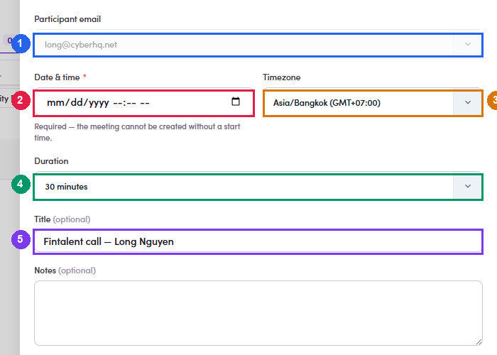
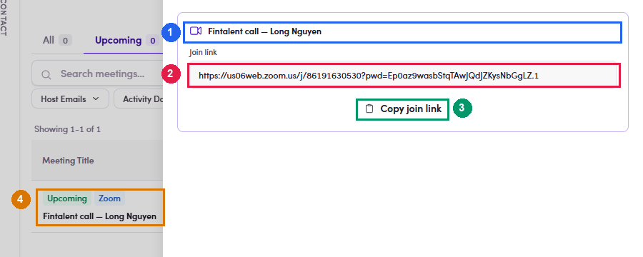
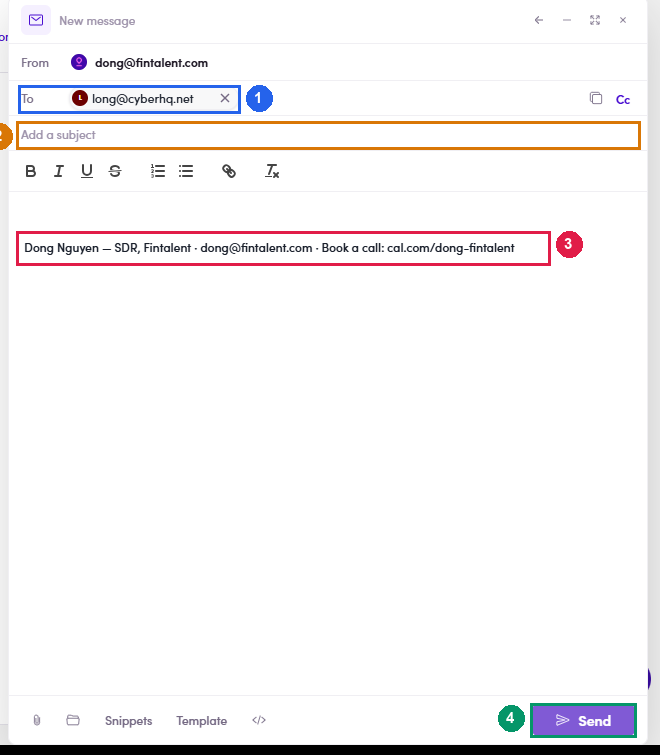

# 4b.1 · Book the call

> 4b · Schedule a call

1. **4b.1.1** — **Open the contact's meetings.** Two doors, same place: The calendar icon sits alongside **✉ Send an email**, **WhatsApp** and **LinkedIn** — the same four actions on every contact row in the product.

   | From | How |
   |---|---|
   | **Any contact row** — a list, the Contacts page, a ME's People tab | the **📅 calendar icon** in the **Action** column, labelled *“View meetings with <name>”*. It opens the contact with the **Meetings** tab already showing. |
   | **Meetings** in the left menu | **+ Create meeting**, top right. Use this when you are not looking at the contact. |

2. **4b.1.2** — **Read the Meetings tab before booking.** It splits into **All · Upcoming · Completed · Cancelled** with counts, so a glance tells you whether this person is already booked. Empty reads *“No calls scheduled with this contact yet.”*

3. **4b.1.3** — **Click *+ Create meeting* and fill the form.** Only one field is genuinely required:

   | Field | Required | What to do with it |
   |---|---|---|
   | **Participant email** | prefilled | The contact's address. If they have several, the dropdown picks which one gets the invite. |
   | **Date & time** | **yes** | The only thing standing between you and a booking — the form says so: *“the meeting cannot be created without a start time”*. Confirm stays disabled until it is set. |
   | **Timezone** | prefilled | Defaults to **your own**, not theirs. Read it again if you agreed a time in their local clock. |
   | **Duration** | defaults to **30 minutes** | Change only if you agreed otherwise. |
   | **Title** | optional | Prefilled *“Fintalent call — <name>”*. Fine as it is; it is what they will see in their calendar. |
   | **Notes** | optional | Context for you, not for them. |

   

   *4b.1.3 — ① participant address, with the picker · ② Date & time, the one required field · ③ timezone — yours · ④ duration · ⑤ the prefilled title.*

4. **4b.1.4** — **Save — the Zoom link is created for you.** The confirmation is not just an acknowledgement, it is a working screen: it shows the meeting title, the **Join link** in full, and a **Copy join link** button. **Copy it now.** This panel is the most convenient place to get the link, and closing it with **Done** is the point at which most people realise they did not.

   

   *4b.1.4 — ① the meeting · ② the auto-generated Zoom join link · ③ Copy join link · ④ the booking, now in the list behind, tagged Upcoming and Zoom.*

5. **4b.1.5** — **Send the link to the contact.** Nothing has been emailed yet — saving a meeting does **not** notify anybody. The compose window does not carry the link**Send email** opens a normal message with the participant already in **To** and your signature in the body — and **nothing else**. The join link is not inserted. Paste it in yourself, or the contact gets an invitation with no way to attend. So the order is: **Copy join link → Send email → paste → write the time and timezone in words → Send.** Templates and Snippets are available in the compose window, so a reusable “here is your call link” snippet is worth building once ([3.x ↗](3-x-edge-cases.md)).

   

   *4b.1.5 — ① the participant, prefilled · ② the subject, empty · ③ the body: signature only, no join link · ④ Send.*
