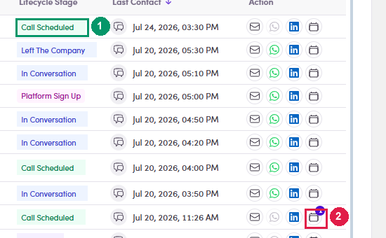

# 4b.1 · Spot it in your replies

> 4b · Schedule a call

1. **4b.1.1** — **Find the ones that asked for a call.** In **Inbox**, open the **Lifecycles** filter and pick **Call Scheduled**. That is the lifecycle stage a contact reaches when a call is on the table, and filtering by it turns your whole inbox into a short worklist.

2. **4b.1.2** — **The *Call Scheduled* chip lives in the *Lifecycle Stage* column** — on your lists and on the Contacts page. The Inbox does not show it by default; it shows Account and Last Email only, so use the filter there rather than hunting for the chip. If you want the chip in the Inbox too, the **⚙** column settings let you switch **Lifecycle** on inside the Account cell — see [4.x.5 ↗](4-x-5-show-hide-columns.md).

   

   *4b.1.2 — ① the Call Scheduled chip, in the Lifecycle Stage column · ② the badge on the calendar icon — how many calls this contact already has.*

3. **4b.1.3** — **Open the reply and read it before you book anything.** Clicking the row opens the contact on **Conversations**, with **Meetings** as the tab next to it — and the tab carries a count, so you can see at a glance whether you have already booked this person.
