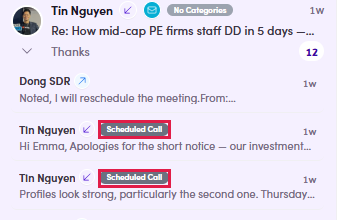
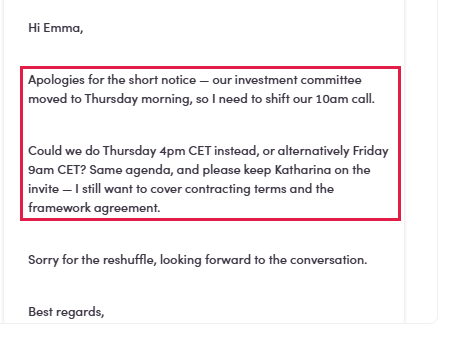

# 4b.1 · Spot it in your replies

> 4b · Schedule a call

## 4b.1.1 · Find the ones that asked for a call. There are four ways in, not one

The signal is almost always a **reply**; the difference is where you go looking for it. The per-ME and per-campaign inboxes are the same screen scoped down. Use them when you are working one send and do not want the rest of your replies in the way; use the global **Inbox** when you are clearing the day.

| The call came up in… | Where you look |
|---|---|
| **Any reply, all channels at once** | **Inbox** in the left menu → **Lifecycles** filter → **Call Scheduled**. The widest net, and the usual starting point. |
| **A reply to one marketing email** | Open the ME → its own **Inbox** tab. It has its own filter bar: **Last replied · Lifecycles · Contact Classification · Owner · Work Experience**, so you can narrow to **Call Scheduled** *within that one send*. URL carries `&marketingEmailTab=Inbox`. |
| **A reply to one campaign** | Same shape: open the campaign → its **Inbox** tab → same filters. |
| **A direct 1:1 message**, or no reply at all | **Contacts** → **Lifecycles** filter → **Call Scheduled**, then open the person. Booking proactively? Skip the filter entirely and go straight to the contact, nothing downstream requires a reply to exist. |

> **Unresolved: what the ME Inbox Lifecycles filter actually reads**
>
> That tab lists **Account and Last Email** and its search box says *“Search **contacts** by keyword”*, which points at it filtering the **contact’s** lifecycle, same as the global Inbox. There is a view that it filters **each reply’s** lifecycle instead. Which would make it a different tool entirely. **Not settled** (the dropdown would not open long enough to capture the request). Do not build a habit on this until somebody confirms it.

## 4b.1.2 · Two chips share the name: know which one you are looking at

This trips people up, because both say much the same thing at different levels: So you **filter** on the contact's lifecycle to build the worklist, then **read** the reply chips inside the thread to find the message that actually asks for something.

| Chip | Sits on | Means |
|---|---|---|
| **Scheduled Call** (dark) | a single **reply**, next to the sender's name in the thread | the system read *that message* and judged it to be about arranging a call. This is the one that tells you what to do. |
| **Call Scheduled** (green) | the **contact**, in the **Lifecycle Stage** column | where this person sits in the pipeline. This is what the **Lifecycles** filter searches. |

> **The reply chip can be buried**
>
> A thread collapses to its most recent message. A conversation showing *No Categories* at the top can still hold **Scheduled Call** replies further down, expand the thread before deciding nothing is there.

*4b.1.2: two replies the system tagged Scheduled Call, inside a thread whose own chip reads \*No Categories\*.*

## 4b.1.3 · Open it and read what they are asking for

The chip only says “this is about a call”. It does not say which call, or what they want doing about it. Real example: Read closely: that one is a **reschedule**, not a new booking, and it names **two options in their timezone**. Sort out which you are dealing with before touching the Meetings screen. A reschedule goes through [4b.x.1 ↗](4b-x-1-they-ask-to-move-it.md), not through 4b.2. Clicking the row opens the contact on **Conversations**, with **Meetings** as the tab beside it, carrying a count, so you can see whether this person is already booked before you read a word.

> **What a Scheduled Call reply looks like**
>
> *“Apologies for the short notice — our investment committee moved to Thursday morning, so I need to **shift our 10am call**. Could we do Thursday 4pm CET instead, or alternatively Friday 9am CET? Same agenda, and please keep Katharina on the invite…”*

*4b.1.3: the part that decides what you do next: they are moving an existing call, and offering two slots in CET.*
