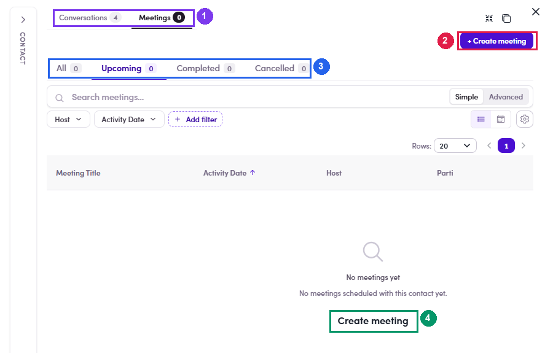
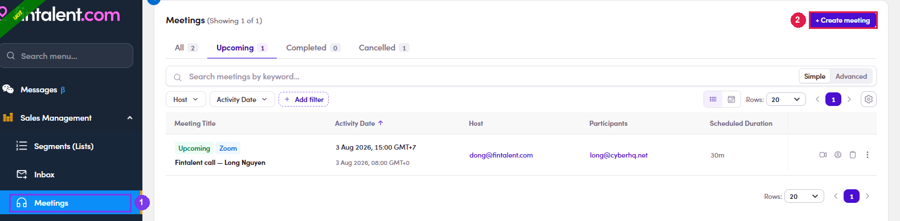
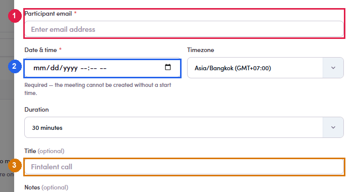

# 4b.2 · Book the call

> 4b · Schedule a call

## 4b.2.1 · Two ways in, and they are not identical

The difference is who fills in the participant: **Prefer the contact route when you are answering a reply.** It carries the right address for you, and it is one click from the conversation you are already in. The Meetings route is for when you have the address in your head and not the contact on screen. Typing the address on the Meetings route still resolves the person: the title comes back as *“Fintalent call — <their name>”*. **The contact route is two clicks, and the second one catches people out.** The calendar icon does not open the booking form — it opens the **contact**, on its **Meetings** tab. The form is behind **+ Create meeting** in the top right of that panel: **The Meetings route is one click.** **Meetings** in the left menu, then **+ Create meeting** in the top right — the same corner as on the contact panel, so the two routes feel alike once you know them. One difference from here: **Participant email** arrives empty, and it only accepts an address that already belongs to a contact — see [4b.x.3 ↗](4b-x-3-the-address-must-be-a-contact.md).

| From | How | Participant email |
|---|---|---|
| **The contact** — any row in a list, Contacts, or a ME's People tab | the **📅** icon in the **Action** column, *“View meetings with <name>”* → **+ Create meeting** | **filled in already**, with a picker if they have several addresses |
| **Meetings** in the left menu | **+ Create meeting**, top right | **empty and required** — you type the address yourself |

- **📅** on the contact's row → the contact opens on **Meetings**.

- **+ Create meeting**, top right — or the **Create meeting** link in the middle when the contact has none yet. Both open the same form.

*4b.2.1 — ① what the 📅 icon opens: the contact on its Meetings tab · ② + Create meeting — the button that opens the form.*

*4b.2.1 — the other way in: ① Meetings in the left menu · ② + Create meeting, which opens the same form.*

*4b.2.1 — the Meetings route: ① Participant email empty and marked required · ② Date & time · ③ the title, waiting to be resolved from the address.*

## 4b.2.2 · Fill the form. Only one field can stop you

| Field | Required | What to do with it |
|---|---|---|
| **Participant email** | **yes** | Prefilled on the contact route. If they have several addresses, the picker decides which one gets the invite. |
| **Date & time** | **yes** | The form says it outright: *“the meeting cannot be created without a start time”*. Confirm stays disabled until it is set. |
| **Timezone** | prefilled | Defaults to **yours**, not theirs. Read it again if you agreed a time in their local clock — see [4b.x.2 ↗](4b-x-4-two-clocks-on-every-row.md). |
| **Duration** | 30 minutes | Change only if you agreed otherwise. |
| **Title** · **Notes** | optional | The title is prefilled and is what shows in their calendar. Notes are for you. |

*4b.2.2 — ① Date & time, the one field that blocks you · ② the timezone it will be read in — yours, not theirs.*

## 4b.2.3 · Save — and copy the link before you close the panel

The confirmation shows the meeting, the full **Zoom join link**, and a **Copy join link** button. Nothing has been emailed to anyone. Closed it too soon? The link is not lost — **Copy join link** is on the meeting's row for as long as the booking exists ([4b.4 ↗](4b-4-manage-booked-calls.md)).

*4b.2.3 — the link is generated for you; the only thing to do here is Copy join link.*
