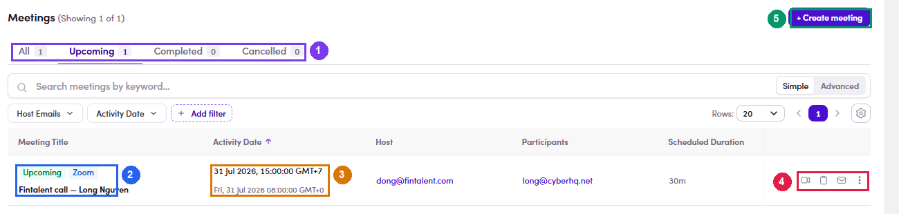

# 4b.2 · Manage booked calls

> 4b · Schedule a call

1. **4b.2.1** — ***Meetings* in the left menu is the full picture** — every call you host, not one contact's. Same four tabs (**All · Upcoming · Completed · Cancelled**), plus search and filters by **Host Emails** and **Activity Date**.

   | Column | What it tells you |
   |---|---|
   | **Meeting Title** | The title, above two chips: the state (**Upcoming**) and the platform (**Zoom**). |
   | **Activity Date** | The start time **twice** — see [4b.x.2 ↗](4b-x-2-two-clocks-on-every-row.md). |
   | **Host** · **Participants** | Both addresses, each with a copy button. |
   | **Scheduled Duration** | e.g. *30m*. |

   

   *4b.2.1 — ① the four tabs · ② state and platform chips · ③ the start time in two timezones · ④ the row actions · ⑤ + Create meeting, also available here.*

2. **4b.2.2** — **Four actions per row, and that is the whole toolkit:**

   | Action | Does |
   |---|---|
   | **Join meeting** | Opens the Zoom room. This is your own way in on the day. |
   | **Copy join link** | The link again, any time after you closed the confirmation panel. |
   | **Send email** | Compose to the participant — still **without** the link ([4b.1.5 ↗](4b-1-book-the-call.md)). |
   | **⋮ → Cancel call** | The only thing in the row menu. Moves the booking to **Cancelled**. |

3. **4b.2.3** — **Check a single contact instead.** The **📅** icon on their row reopens the same list scoped to them, next to **Conversations** — so the email thread and the booking sit side by side, which is what you want when they ask to move the time.
