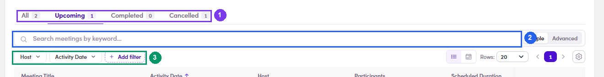
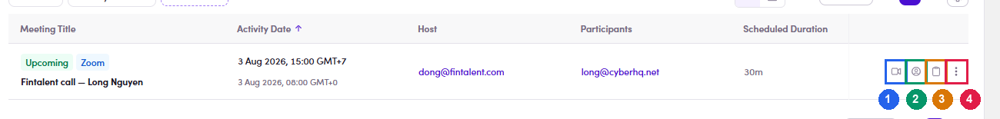
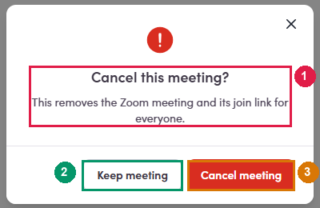

# 4b.4 · Manage booked calls

> 4b · Schedule a call

## 4b.4.1 · Where to look, depending on what you are asking

| You want… | Go to |
|---|---|
| **Every call you host** | **Meetings** in the left menu. Tabs **All · Upcoming · Completed · Cancelled**, plus search and filters by **Host · Contact · Activity Date**. The **Contact** filter is the quick way to pull every call with one person without leaving the page. |
| **Which contacts have a call booked at all** | **Contacts** → **Add filter** → **Has meeting** (under **OUTREACH**, beside Campaign and Marketing Email). Turns the contact list into “everyone with a booking”, the reverse of the Contact filter on the Meetings page. |
| **One contact's calls** | the **📅** icon on their row → the contact opens on its **Meetings** tab, same four sub-tabs, scoped to them. |
| **Just the number, without opening anything** | the **small badge on that same 📅 icon**. No badge means no calls. |
| **The Meetings tab in a contact you already have open** | it sits next to **Conversations**, with its own count. |
| **To cancel** | the meeting's row → **⋮** → **Cancel meeting**. |

*4b.4.1: how you narrow the list: ① the four tabs with their counts · ② search by keyword · ③ filters by Host · Contact · Activity Date.*

## 4b.4.2 · What each control on a row does

Four of them, and the first two are not the same thing: If you take one thing from this section**Send the contact the *join* link. Open the call yourself with *Start as host*.** Handing out a host link would let whoever holds it run your meeting.

| Control | Opens | Use when |
|---|---|---|
| **Join meeting** | the ordinary **join** link, the same one the contact got | you want to see what they see, or you are joining a call somebody else hosts. You may land in the waiting room. |
| **Start as host** | the **host start** link, carrying a host token | **this is the one to use on the day.** It opens the room with host rights, admitting people, recording, ending the call. The token is short-lived, so start it near the time, not hours before. |
| **Copy join link** | : | sending or resending the link to the contact. |
| **⋮** | **Send email** · **Cancel meeting** | the only two row actions. There is no edit. |

*4b.4.2: the four, left to right: ① Join meeting · ② Start as host · ③ Copy join link · ④ ⋮, which holds Send email and Cancel meeting.*

## 4b.4.3 · Cancelling, and what it destroys

**⋮ → Cancel meeting** asks first, and the dialog is worth reading: *“This removes the Zoom meeting and its join link **for everyone**.”* Confirm and the booking leaves **Upcoming** and lands in **Cancelled**. It is not deleted, so the history stays. **The contact is not told.** If a real person was expecting that call, the cancellation email is yours to write. The tab counters do not refresh on the spot, they still read the old numbers until you reload the page. Do not take that as the cancellation having failed.

*4b.4.3: read the warning, then Cancel meeting commits it. Keep meeting backs out.*
