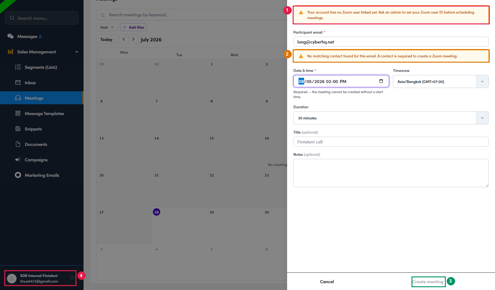

# 4b.x.2 · No Zoom on your account

> 4b · Schedule a call → 4b.x · Edge cases

**The form warns you before you start. Your account has no Zoom.** Meetings are created on a **Zoom account tied to you as the host**. If nobody has linked one to your admin record, the form says so in a banner the moment it opens, and **Create meeting stays greyed out** no matter what you fill in: What you will see*“Your account has no Zoom user linked yet. **Ask an admin to set your Zoom user ID** before scheduling meetings.”* **There is nothing to fix on your side**, no setting, no retry. Ask an Admin to set your Zoom user ID. Meanwhile, either ask a colleague who is set up to host the call, or send a link from your own Zoom by hand. Know what that costs you, though. A booking made outside Fintalent will **not** appear on the Meetings page, it will not show on the contact, and it gives you no **Start as host** button. Verified on a real SDR account with no Zoom user (*SDR Internal Fintalent*). Note the block is a **guard, not a failure**: the form refuses up front rather than letting you fill everything in and erroring on save.

*4b.x.2: ① the Zoom warning, shown before you type anything · ② the second guard from [4b.x.3 ↗](4b-x-3-the-address-must-be-a-contact.md) · ③ Create meeting, greyed out · ④ the account this was reproduced on.*
