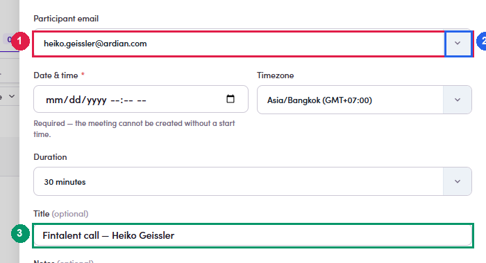

# 4b.x.6 · Contact with several addresses

> 4b · Schedule a call → 4b.x · Edge cases

**The contact has several addresses — which one gets the invite.** On the contact route the **Participant email** field is a **picker**, not a label: it opens with the address on the contact record already chosen, and the chevron on the right lists the others. **Check it whenever you are answering a thread.** A contact can hold a work address, a personal one and a platform sign-up address, and the one the conversation is running on is not always the one the field defaults to. Pick the address they actually wrote from — the invitation goes to the selected one and nowhere else. There is no changing it afterwards. Wrong address means [cancel and rebook ↗](4b-x-1-they-ask-to-move-it.md), which mints a new link.

*4b.x.6 — ① Participant email, prefilled from the contact · ② the chevron that lists their other addresses · ③ the title, resolved from whoever the address belongs to.*
