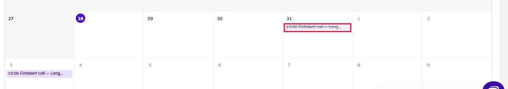

# 4b.x.7 · List view vs Calendar view

> 4b · Schedule a call → 4b.x · Edge cases

**Two ways to read the list — and the calendar shows what the table hides.** Top right of the Meetings page sits a **List view / Calendar view** toggle. Calendar view adds **Month / Week** and a **Today** button, and answers “what does my week look like?” far quicker than the table. **Cancelled bookings appear struck through** rather than hidden, so a slot you gave up is still visible in its place — useful when a contact asks what happened to the call you had agreed. The choice sticks: come back to Meetings later and it opens in whichever view you left it in.

*4b.x.7 — a cancelled booking stays in its slot, struck through, instead of disappearing.*
