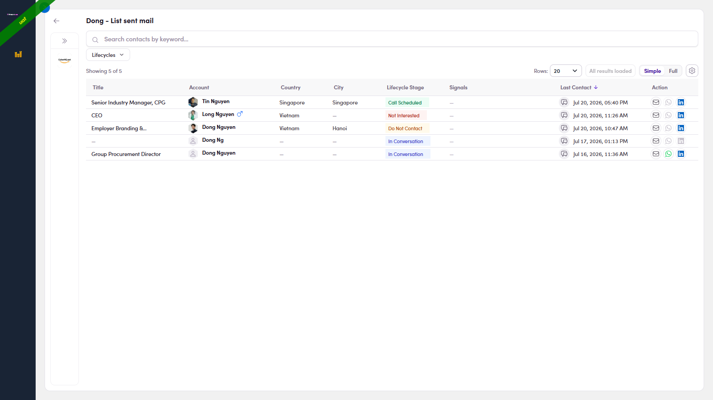

# 5.2 · View the contacts

> 5 · Follow up on silent prospects

**View the contacts:** the members table. Look at the **Last Contact** column (far right) — each row has a **💬 icon** next to its date, the follow-up radar.

*5.2 — the members table; the Last Contact column with its 💬 icons is on the right.*
