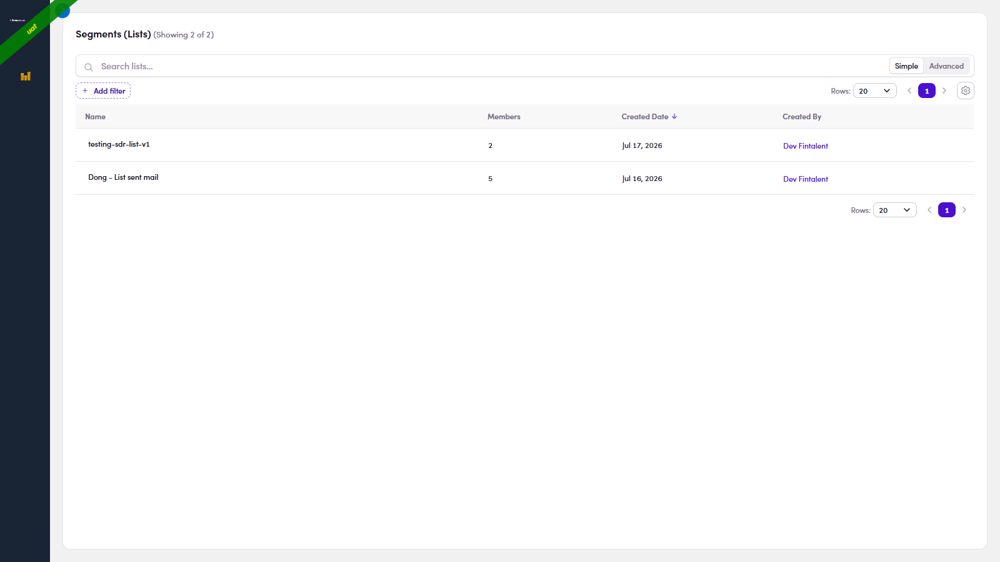
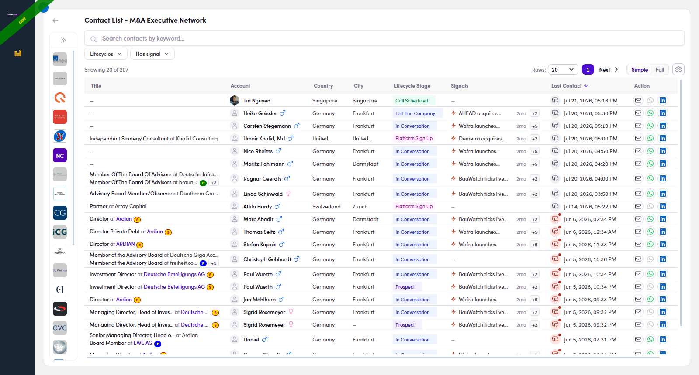
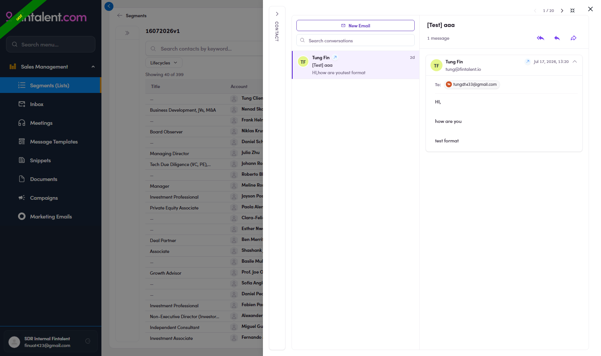

# 5 · Follow up on silent prospects

> SDR

1. **5.1** — **Open your assigned list:** left menu → **Segments (Lists)** → open your list.

   

   *5.1: your assigned lists; click one to open it.*

2. **5.2** — **View the contacts:** the members table. Look at the **Last Contact** column (far right). Each row has a **💬 icon** next to its date, the follow-up radar.

   

   *5.2: the members table; the Last Contact column with its 💬 icons is on the right.*

3. **5.3** — **Pick who's overdue:** click the **Last Contact** header to sort (oldest first), then read the **💬 aging icon** next to each date. Its **colour** tells you how long since you last touched that contact, so you work the coldest first. The little **red dot** is a "due" flag that clears the moment you make contact.

   | 💬 icon | How old | What it means | Your move |
   |---|---|---|---|
   | **grey** | ≲ 2 weeks | Fresh, you contacted them recently. | Leave it for now. |
   | 💬 **yellow** | ~2–4 weeks | Coming due: the gap is opening up. | Line it up for a nudge. |
   | **red + dot** | ≳ 1 month | Overdue, waited the longest; the **red dot** is a "due" flag on the icon. | **Follow up first**; the dot clears once you make contact. |

   

   *5.3: 💬 icons shading gray → yellow → red as Last Contact ages.*

4. **5.4** — **Read the context.** Click the **💬 icon** on that row → a conversation-first drawer opens with the last thread on screen. Read the exchange to confirm they **haven't replied yet** (that's what "follow up" means) and to pick your angle.

   

   *5.4: 💬 clicked: the last thread on screen (New Email · ↩ reply · 1/N pager).*

5. **5.5** — **Nudge them.** Then either **↩ reply to the last email** in that thread (keeps the context), or click **New Email** for a fresh angle. Sending **resets Last Contact** → the row drops down and the 💬 turns gray. Use the **1/N pager** (top right) to step to the next contact without going back to the list.

6. **5.6** — 2–3 unanswered nudges → label **Not Now** / **Not Interested** (Flow 3) so they leave your rotation.

| 💬 state | Meaning | Do |
|---|---|---|
| Gray, no dot | Recent (~under 2 weeks) | Nothing yet |
| Yellow + dot | ~2–4 weeks silence | Plan the nudge |
| Red + dot | ~A month+, overdue | Click & follow up now |

## In this flow

* [5.1 · Open your list](5-1-open-your-list.md)
* [5.2 · View the contacts](5-2-view-the-contacts.md)
* [5.3 · Pick who's overdue](5-3-pick-who-s-overdue.md)
* [5.4 · Read the context](5-4-read-the-context.md)
* [5.5 · Reply or new mail](5-5-reply-or-new-mail.md)
