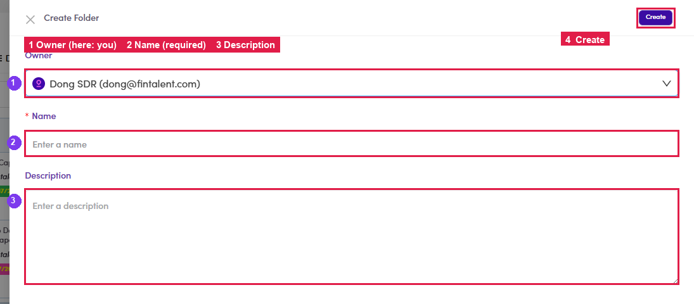

# 6.1.2 · Create a folder

> 6 · Manage a campaign → 6.1 · Create (folder first)

**Create a folder.** Click **+ Create Folder** (top-right) → fill **Owner** (usually **you**), **Name** (required) and **Description** → **Create**.

*6.1.2: the Create Folder form: ① Owner (here: you) · ② Name (required) · ③ Description · ④ Create.*
