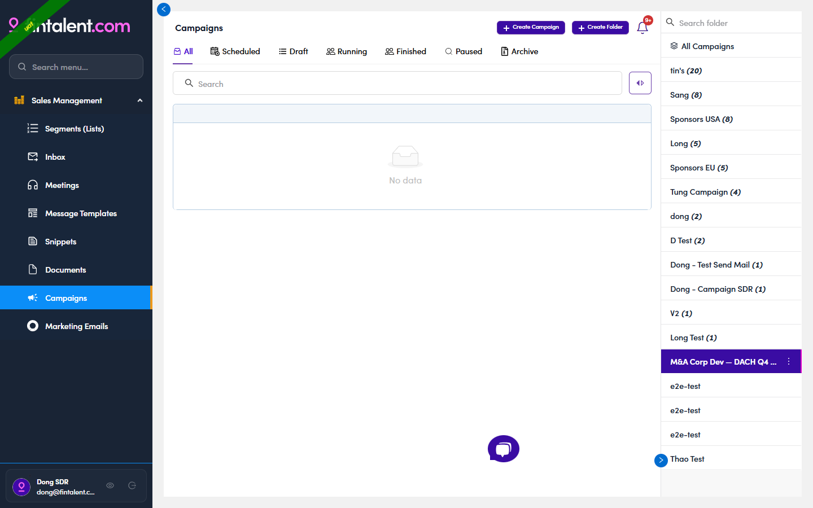

# 6.1.3 · Open your folder

> 6 · Manage a campaign → 6.1 · Create (folder first)

**Open your folder.** You land inside the new folder — it's highlighted in the right-hand **folder rail**. (Come back to it any time by clicking it in the rail; rename it later via its **⋮** menu — [6.x.3 ↗](6-x-3-folders-and-owner.md).)

*6.1.3 — inside your folder: ② the folder is selected in the rail · ① the + Create Campaign button appears.*
