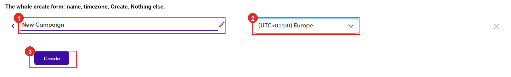

# 6.1 · Create (folder first)

> 6 · Manage a campaign

**Campaigns live inside folders.** So, unlike a Marketing Email, which you create directly, you **create a folder first**, open it, and only then create the campaign.

## 6.1.5 · Name it and pick the timezone

A single form opens with three things on it and nothing else: the **name** (it arrives pre-filled with *New Campaign*, so type over it), the **timezone** the sending clock runs on, and **Create**. The **✎** next to the name just puts your cursor in the field. Neither one is locked in. You can rename the campaign later from its header ([6.x.15 ↗](6-x-15-rename-description.md)).

*6.1.5: the whole form: ① name (pre-filled \*New Campaign\*) · ② timezone · ③ Create.*

## 6.1.6 · Create, and you land in the campaign

There is no second wizard page and nothing to skip. **Create** drops you straight into the new campaign, on the **Steps** tab, with the tab bar reading **Steps · People · Data Health · Timeline**. The campaign is a **Draft** with no steps and nobody in it, so the two jobs waiting for you are [6.2 · the sequence](6-2-build-the-sequence.md) and [6.4 · the people](6-4-add-and-remove-people.md). **Two tabs are missing at this point and that is normal.** **Inbox** and **Preview** only appear once the campaign has a step and some people in it.

## In this step

* [6.1.1 · Open Campaigns](6-1-1-open-campaigns.md)
* [6.1.2 · Create a folder](6-1-2-create-a-folder.md)
* [6.1.3 · Open your folder](6-1-3-open-your-folder.md)
* [6.1.4 · Create the campaign](6-1-4-create-the-campaign.md)
