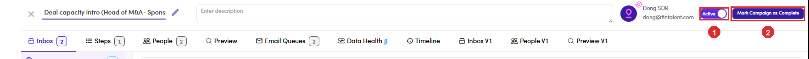

# 6.10.2 · Mark Campaign as Complete

> 6 · Manage a campaign → 6.10 · Finish a campaign

**Open the campaign and click Mark Campaign as Complete.** The button sits in the **header of the campaign**, top right, beside the **Active** switch. It is the only control that ends a campaign; nothing in the list row does it. The campaign moves to **Finished** and stops sending. Queued mail that has not left is not a leftover to deal with later, so check the queue is empty first ([6.7 ↗](6-7-email-queue.md)) rather than finishing on top of it.

*6.10.2, an Admin session: ① the status switch, live · ② Mark Campaign as Complete, beside it. The name in the header is the campaign's owner, not the person signed in.*
