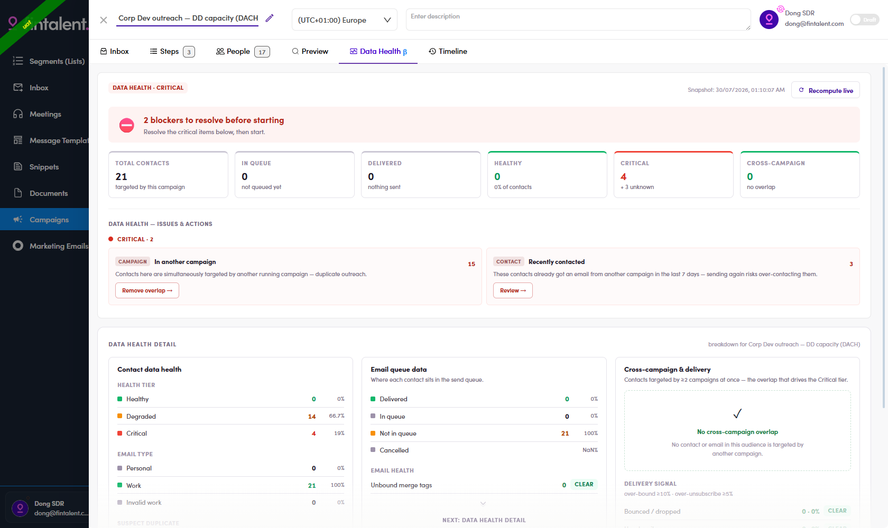

# 6.12 · Data Health — check before you start

> 6 · Manage a campaign

A tab inside every campaign that grades the audience **before** a single email goes out. It is the cheapest thing you can do to stop a bad send.

Marked **β** in the tab strip. Marketing Emails have the same tab ([7.11 ↗](7-11-data-health.md)).

## 6.12.1 · Open it and run the check

Open the campaign → the **Data Health β** tab.

The first time it reads **"No health snapshot yet — This campaign hasn't been checked yet. Run the health check to see the audience verdict + issue breakdown here."** Click **↻ Recompute live**.

After it runs the header shows the tier — **`DATA HEALTH · CRITICAL`** — and a **Snapshot** timestamp. The snapshot is frozen at that moment; press **Recompute live** again after you change the audience.

## 6.12.2 · Read the blocker banner first

A red banner counts what stands between you and a send:

> ⛔ **2 blockers to resolve before starting** — Resolve the critical items below, then start.

If it says zero, nothing below is urgent.

## 6.12.3 · The six cards

| Card | Reads |
|---|---|
| **TOTAL CONTACTS** | how many this campaign targets |
| **IN QUEUE** | queued but not sent |
| **DELIVERED** | already gone |
| **HEALTHY** | count + % of contacts |
| **CRITICAL** | count, plus **"+ N unknown"** — contacts with no health tier at all |
| **CROSS-CAMPAIGN** | how many are also in another campaign |

> **`TOTAL CONTACTS` here is the number to trust.** On a campaign that really had 21 people, this card read **21** while the **People** tab on the same campaign read **17**. See [6.x.15 ↗](6-x-15-people-tab-undercounts.md).

## 6.12.4 · Work the Issues & Actions

Each issue is a card with a count and its own button.

| Issue | What it means | Button |
|---|---|---|
| `CAMPAIGN` **In another campaign** | these contacts are targeted by another **running** campaign right now — duplicate outreach | **Remove overlap →** |
| `CONTACT` **Recently contacted** | they already got an email from another campaign **in the last 7 days** — sending again risks over-contacting | **Review →** |

## 6.12.5 · The detail panels

**Contact data health**

* **HEALTH TIER** — Healthy / Degraded / Critical, each with count and %
* **EMAIL TYPE** — Personal · Work · **Invalid work**
* **SUSPECT DUPLICATE** — pairs inside this campaign
* **LIFECYCLE RISK** — contacts excluded from campaign sends by their lifecycle

**Email queue data** — *"Where each contact sits in the send queue"*: Delivered · In queue · **Not in queue** · Cancelled. Plus **EMAIL HEALTH → Unbound merge tags** — any `{{variable}}` that will not resolve. Anything other than `0` here means somebody receives a broken sentence.

**Cross-campaign & delivery** — the overlap that drives the Critical tier, plus **DELIVERY SIGNAL** with its thresholds spelled out (*over-bound ≥10% · over-unsubscribe ≥5%*), **Bounced / dropped**, **Unsubscribe pressure**, and a **RECENTLY CONTACTED · 7 DAYS** list naming the actual email addresses.

A green **CLEAR** chip means that row is fine.

## Two things on this tab that do not add up

Both seen on the same screen, same snapshot — treat the panel as a hint, not gospel.

| | |
|---|---|
| **Cross-campaign contradicts itself** | the card read **CROSS-CAMPAIGN 0 · no overlap** and the panel read **✓ No cross-campaign overlap — No contact or email in this audience is targeted by another campaign**, while the Critical issue above said **In another campaign · 15**. Fifteen contacts cannot be both |
| **`Cancelled — NaN%`** | with nothing sent yet, the Cancelled row divides by zero and prints `NaN%` instead of `0%` or `—` |
