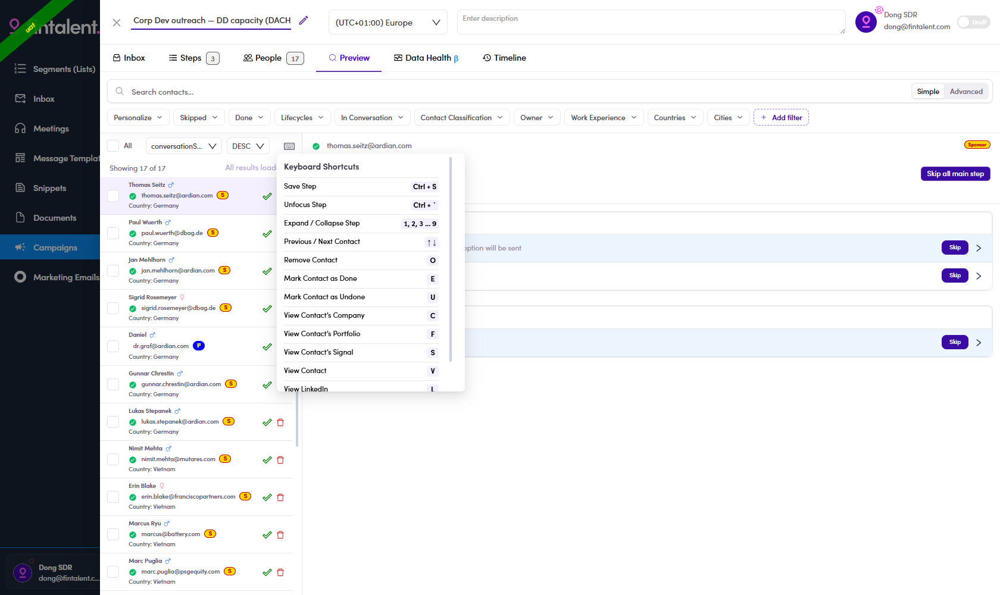

# 6.13 · Keyboard shortcuts in Preview

> 6 · Manage a campaign → 6.5 · Preview & review

**Reviewing a campaign is the slowest part of the job, and it is entirely keyboard-driven if you want it to be.** The shortcuts are real but hidden — nothing on screen advertises them.

Works the same on a Marketing Email's Preview tab ([7.4 ↗](7-4-preview-and-mark-reviewed.md)).

## 6.13.1 · Find the panel

Open the campaign → **Preview** tab. Above the contact list on the left, in the row with the **All** checkbox and the two sort dropdowns, there is a small **keyboard icon** at the right-hand end. Click it.

*6.13.1 — the panel, open over the contact list. It scrolls; there are more rows than fit.*

## 6.13.2 · The full list

**Moving**

| Action | Key |
|---|---|
| Previous / Next contact | `↑` `↓` |
| Expand / collapse a step | `1`, `2`, `3` … `9` |
| Unfocus step | `Ctrl` + `` ` `` |

**Deciding on the contact in front of you**

| Action | Key |
|---|---|
| Mark contact as **Done** | `E` |
| Mark contact as **Undone** | `U` |
| **Remove** contact from the campaign | `O` |

**Opening what you need to judge them**

| Action | Key |
|---|---|
| View contact | `V` |
| View contact's **company** | `C` |
| View contact's **portfolio** | `F` |
| View contact's **signal** | `S` |
| View **LinkedIn** | `L` |
| View **linked HubSpot** | `H` |

**Saving**

| Action | Key |
|---|---|
| Save step | `Ctrl` + `S` |

## 6.13.3 · The loop worth learning

`↓` to the next contact · `C` if you need to see who they work for · `E` to mark done · `↓` again. That is the whole review pass without touching the mouse.

`O` removes somebody permanently from the campaign — it sits one key away from `E` on most layouts and there is no undo prompt. Slow down on that one.

> **`H` — View linked HubSpot.** The only place in the whole admin that admits a HubSpot link exists. Nothing else in these flows mentions it; if the shortcut does nothing on your contacts, the link is simply not set.
