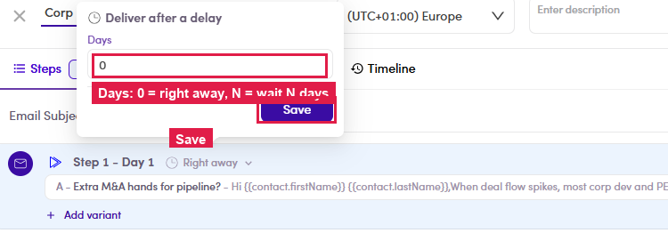

# 6.2.4 · Timing (delay)

> 6 · Manage a campaign → 6.2 · Build the sequence

**Timing.** Click the timing pill to set **Deliver after a delay** (**Days**). **0** = right away; **N** = this step goes out N days after the previous one, that's the **"Day X"** label on the step.

*6.2.4: Deliver after a delay: Days = N (0 = Right away).*
