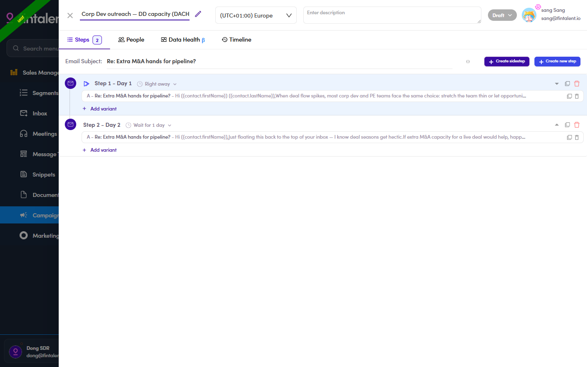

# 6.2.5 · Add follow-ups

> 6 · Manage a campaign → 6.2 · Build the sequence

**Add follow-ups with + Create new step.** A follow-up usually waits a day or two, for example **Step 2 - Day 2** and *Wait for 1 day*. Build the whole sequence this way. **There is a second button beside it, and it does something different.** **+ Create new step** adds the next email **everyone** gets. **+ Create sidestep** adds a branch that only fires when a contact’s reply lands in a category you choose, an automatic answer to an **Out Of Office** being the usual case. Building one is an edge case rather than part of the main sequence, so it lives at [6.x.2 · Sidestep ↗](6-x-2-sidestep-conditional.md).

*6.2.5: a 2-step sequence: Step 1 Right away, Step 2 Wait 1 day.*
