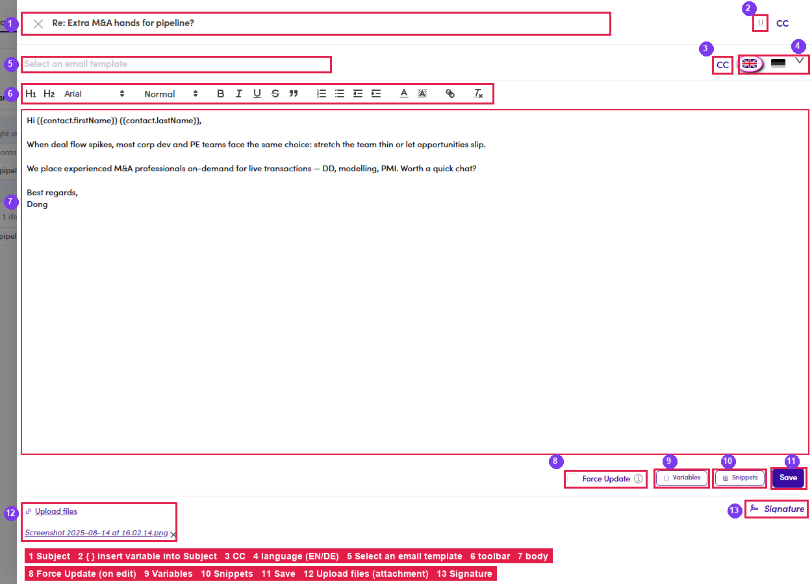
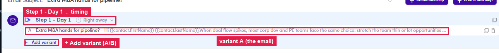

# 6.2 · Build the sequence

> 6 · Manage a campaign

A campaign is a **list of steps**. Each step is **one email** with a **timing** (send right away, or wait N days) and one or more **variants** (A/B). The step editor is **identical to a Marketing Email step**.

## 6.2.2 · Write the step

Every field of the editor, and what goes in it:

| # | Field / control | What it does · how to write it |
|---|---|---|
| 1 | **Subject** | The email's subject line. Type it plainly, and you **can personalize it with variables** via the **{ }** icon (2). |
| 2 | **{ }** | Inserts a **variable** (merge field) into the **Subject**, e.g. `{{contact.companyName}}`. Details: [6.x.8 ↗](6-x-8-variables.md). |
| 3 | **CC** | Copy someone on every send of this step, click **CC**, an **Add cc** field opens. |
| 4 | **Language (EN / DE)** | The flags switch between the **English and German version** of this step, write one per language you send in. |
| 5 | **Select an email template** | **Yes, templates work here**, prefill the whole step from a saved template instead of writing from scratch. Details: [6.x.7 ↗](6-x-7-start-from-a-template.md). |
| 6 | **Formatting toolbar** | Rich text: H1/H2, font & size, **B**/*I*/U/S, quote, lists, indent, colour, link, clear-format. |
| 7 | **Body** | The message itself. **Variables** (9) and **Snippets** (10) both work in the body; write short, personal, one clear ask. |
| 8 | **Force Update** | Only matters when **editing** a step later, tick it to push your edit onto previews already generated. Details: [6.x.12 ↗](6-x-12-force-update.md). |
| 9 | **Variables** | **Yes**: insert merge fields (`{{contact.firstName}}`…) that fill in per contact. Details: [6.x.8 ↗](6-x-8-variables.md). |
| 10 | **Snippets** | **Yes**: drop in a saved reusable block (enables once your cursor is in the body). Details: [6.x.9 ↗](6-x-9-snippets.md). |
| 11 | **Create / Save** | **Create** saves a new step; re-open a step later and the button reads **Save**. |
| 12 | **Upload files** | Attach files to the email; each attachment shows with an **✕** to remove. Details: [6.x.10 ↗](6-x-10-attachments-signature.md). |
| 13 | **Signature** | Appends your email signature (set up in Flow 1.x.5). |

*6.2.2: the step editor with every field numbered 1–13 (same numbers as the table).*

## 6.2.3

The step lists as **Step 1 - Day 1** with its **timing** ("Right away") and variant **A**. **The header carries a running day count, not just the delay.** *Right away* is Day 1; a step set to *Wait for 10 days* after a Day 2 step reads **Step 3 - Day 12**. Read the last step’s day to see how long the whole sequence runs. **The Steps badge counts every step in every branch.** Once the campaign has sidesteps the badge exceeds the main sequence, 2 main steps plus 4 branches reads **Steps 8**. That is correct, not a miscount ([6.x.2 ↗](6-x-2-sidestep-conditional.md)).

*6.2.3: Step 1 · Day 1 · Right away · variant A.*

**Where to click** once the sequence exists, everything lives on the Steps tab:

*6.2: building the sequence: ① + Create new step (next email) · ② + Create sidestep (conditional) · ③ timing pill · ④ + Add variant (A/B) · ⑤ click a variant row to edit it · right icons: duplicate / delete.*

Two campaign-only extras. **A/B variants** put two versions of the same step side by side and send each contact one of them at random ([6.x.1 ↗](6-x-1-a-b-variants.md)). **Sidesteps** are a branch that fires on a condition rather than in sequence ([6.x.2 ↗](6-x-2-sidestep-conditional.md)).

## In this step

* [6.2.1 · Create new step](6-2-1-create-new-step.md)
* [6.2.4 · Timing (delay)](6-2-4-timing-delay.md)
* [6.2.5 · Add follow-ups](6-2-5-add-follow-ups.md)
* [↳ edge case · Add a sidestep](6-x-2-sidestep-conditional.md)
