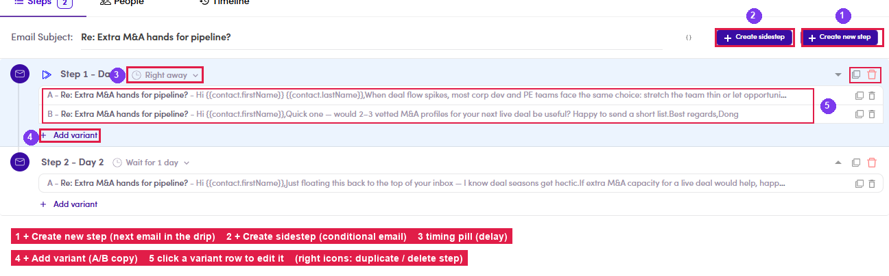

# 6.2 · Build the sequence

> 6 · Manage a campaign

A campaign is a **list of steps**. Each step is **one email** with a **timing** (send right away, or wait N days) and one or more **variants** (A/B). The step editor is **identical to a Marketing Email step**.

**Where to click** once the sequence exists — everything lives on the Steps tab:

*6.2 — building the sequence: ① + Create new step (next email) · ② + Create sidestep (conditional) · ③ timing pill · ④ + Add variant (A/B) · ⑤ click a variant row to edit it · right icons: duplicate / delete.*

Two campaign-only extras — **A/B variants** and **Sidesteps** — are in [Edge cases (6.x) ↗](6-x-edge-cases.md).

### In this step

* [6.2.1 · Create new step](6-2-1-create-new-step.md)
* [6.2.2 · Write the step (fields)](6-2-2-write-the-step-fields.md)
* [6.2.3 · Step 1 appears](6-2-3-step-1-appears.md)
* [6.2.4 · Timing (delay)](6-2-4-timing-delay.md)
* [6.2.5 · Add follow-ups](6-2-5-add-follow-ups.md)
