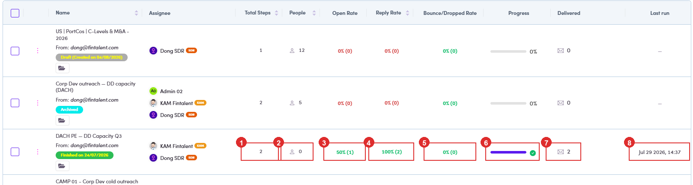

# 6.3 · View campaigns

> 6 · Manage a campaign

Left menu → **Campaigns** lists every campaign, grouped into **folders** (right rail). The top tabs filter by **status**: **All, Scheduled, Draft, Running, Finished, Paused and Archive**. Each row shows the **Enabled** toggle, **Total Steps**, **People**, **Open / Reply / Bounce rates**, **Progress**, **Delivered** and **Last run**.

*6.3: the campaign list: status tabs, the folder rail, the Enabled toggle and per-campaign metrics.*

**The numbers on the row are the campaign's report card, and you can read the whole thing without opening it.** Every figure has a tooltip, so hover anything you are unsure of.

| # | Column | What it is telling you |
|---|---|---|
| **1** | **Total Steps** | how many emails the sequence holds. It counts **every branch too**, so a campaign with sidesteps reads higher than the main sequence ([6.x.2 ↗](6-x-2-sidestep-conditional.md)). |
| **2** | **People** | how many contacts are in the campaign right now. |
| **3** | **Open Rate** | opens measured against **what was actually sent**, not against the whole list. The bracketed figure is the raw count. |
| **4** | **Reply Rate** | the one that matters. A reply is a person, not a statistic, so go and read it. |
| **5** | **Bounce / Dropped Rate** | addresses that refused it. Treat it as a to-do list rather than a number ([6.8a ↗](6-8a-find-bounces-and-drops.md)). |
| **6** | **Progress** | how far through the sequence the campaign is. The bar fills as steps go out, and a green tick means every queued email has left. |
| **7** | **Delivered** | how many emails have actually gone out. |
| **8** | **Last run** | when it last sent anything. A dash means it has never run. |

*6.3: one row read across, \*DACH PE · DD Capacity Q3\*: ① 2 steps · ② 0 people · ③ Open 50% (1) · ④ Reply 100% (2) · ⑤ Bounce 0% (0) · ⑥ Progress full, with the green tick · ⑦ Delivered 2 · ⑧ Last run Jul 29. The rows above it have never run, which is why their bars are empty and their Last run is a dash.*

**A blank rate and 0% are not the same thing.** Blank means nothing was sent yet. **0%** means it went out and nobody opened or replied, which is a result about the writing, not the sending.
