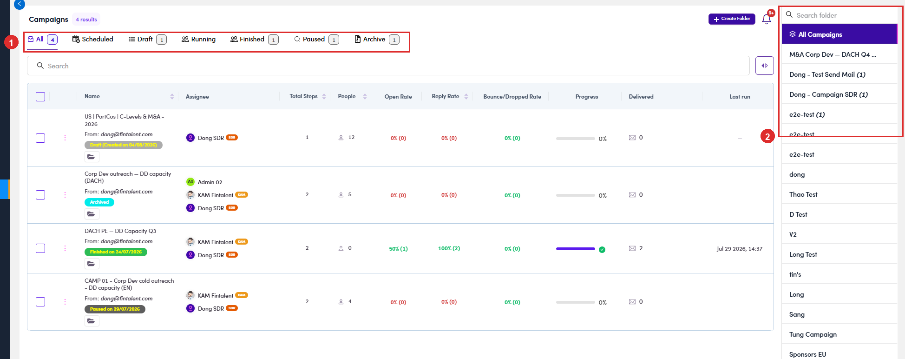

# 6.3 · View campaigns

> 6 · Manage a campaign

Left menu → **Campaigns** lists every campaign, grouped into **folders** (right rail). The top tabs filter by **status**: **All · Scheduled · Draft · Running · Finished · Paused · Archive**. Each row shows the **Enabled** toggle, **Total Steps**, **People**, **Open / Reply / Bounce rates**, **Progress**, **Delivered** and **Last run**.

*6.3 — the campaign list: status tabs, the folder rail, the Enabled toggle and per-campaign metrics.*
