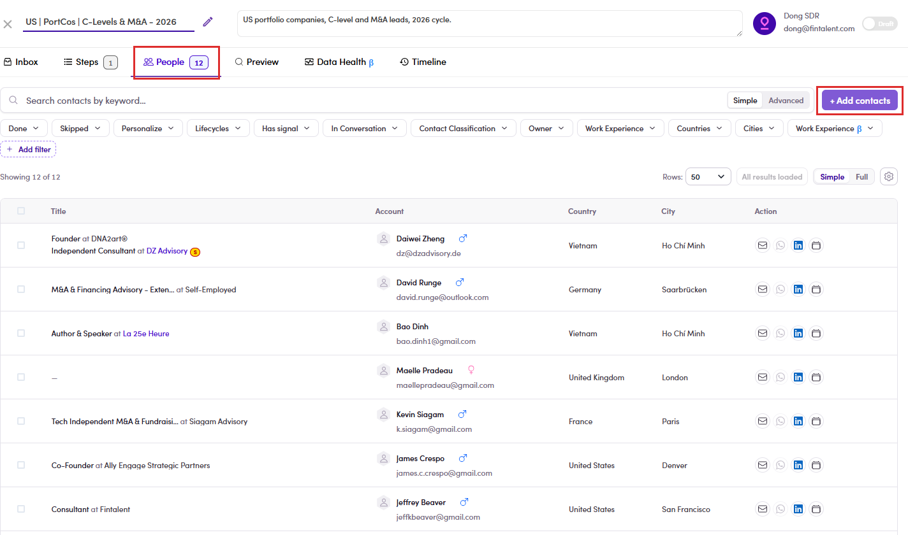

# 6.4.1 · + Add contacts

> 6 · Manage a campaign → 6.4 · Add people

**Open the campaign and move to the People tab.** The tabs run along the top of the campaign, and **People** is the third one, between **Steps** and **Preview**. The number beside it is how many people are in the campaign at the moment, so on a campaign you have just created it reads **0**. Once you are on that tab, the button you want is **+ Add contacts**, over on the **right-hand side, level with the search box**. It is the only purple button on the screen.

*6.4.1: the People tab in the tab bar, and + Add contacts on the right.*
