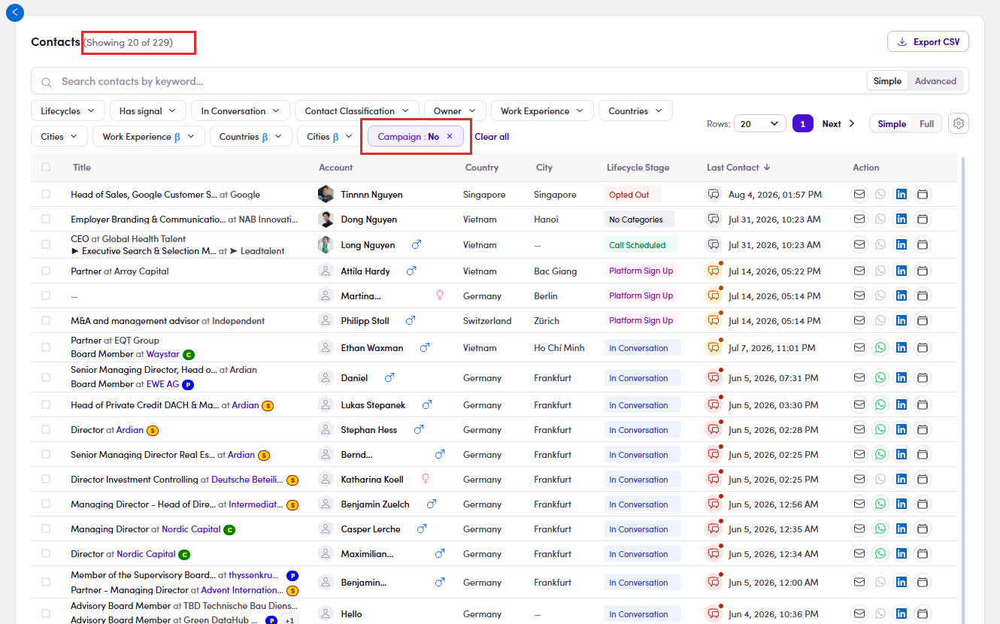

# 6.4.2 · The pre-filtered list

> 6 · Manage a campaign → 6.4 · Add and remove people

**You land on the Contacts page, and it arrives already filtered.** The button does not open a picker inside the campaign. It moves you to **Contacts**, which is every contact across the lists you have been assigned, and on the way it switches on one filter chip for you: **Campaign : No**. That chip is the whole point of the screen. Everything you can see is **somebody who is not in a campaign yet**, because a contact belongs to **one campaign at a time**. The count at the top, next to the word *Contacts*, is counting only those people. Filters you set on your last visit to Contacts are still on. Read the whole chip row before you trust the count.

*6.4.2: the Campaign : No chip is already on when you arrive, and the count at the top reflects it.*

> **Do not clear that chip**
>
> Clearing it, or clicking **Clear all**, puts back the people who **cannot be added anyway**. All you get is a longer list and a better chance of picking the wrong person. **Add filters on top of it instead.** That is how you narrow 229 contacts down to the group you actually want in this campaign: country, seniority, work experience, whatever the campaign is aimed at. The chip row stacks, so **Campaign : No** stays on while you filter. See [Flow 8 · Using filters ↗](8-using-filters.md).
