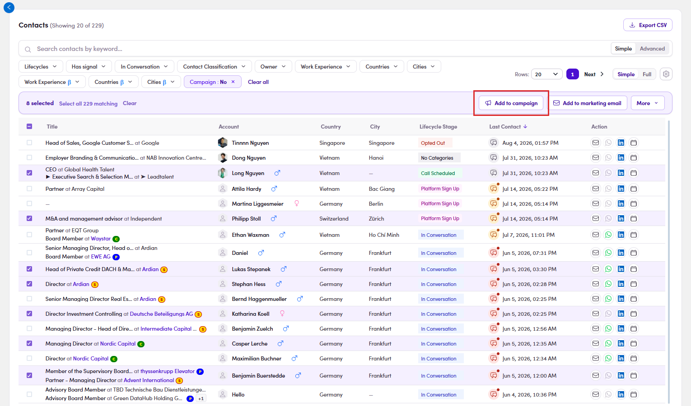

# 6.4.3 · Tick your people

> 6 · Manage a campaign → 6.4 · Add people

**Find your people and tick them.** Same tools as [Flow 2 · Find a target contact ↗](2-find-a-target-contact.md). Tick the rows, or tick the header box to take the whole page, then click **Add to campaign** on the action bar.

*6.4.3: ticking anything brings up the action bar, with Add to campaign on it. Select all N matching beside the count reaches past the page you can see.*
