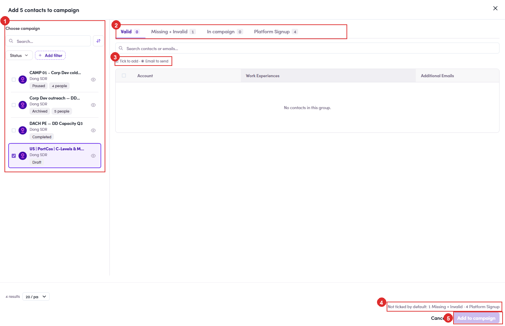

# 6.4.4 · The drawer: 4 groups

> 6 · Manage a campaign → 6.4 · Add people

**The drawer: pick the campaign, then pick who actually gets mailed.** It opens headed *Add N contacts to campaign* and splits in two. **Left: Choose campaign.** Your campaigns, each showing owner, status and how many people it already holds, with a search box and a **Status** filter. There is an **👁** on each row to look at one before you commit. **Tick exactly one.** **Right: the people, sorted into four groups.** A contact can hold several addresses and a campaign sends to **one address per contact**, so the drawer sorts them by how good that address is: The line along the bottom spells out what it left alone, for example *Not ticked by default: 5 Missing + Invalid · 15 Platform Signup*. Nothing stops you ticking those groups by hand; just know you are choosing to mail an address the system is not confident about.

| Group | What is in it | Ticked for you? |
|---|---|---|
| **Valid** | a verified address. These are the ones you want. | **Yes** |
| **Missing + Invalid** | no address at all, or one that failed validation. | No |
| **In campaign** | **already in another campaign**, so they cannot join this one. | No |
| **Platform Signup** | only the address they signed up to the platform with. | No |

*6.4.4: ① Choose campaign, tick one · ② the four groups · ③ the tick adds them, the dot picks which address · ④ what was left unticked · ⑤ Add to campaign.*

> **In campaign is usually empty, and that is the filter's doing**
>
> Because step 6.4.2 already filtered out everyone who is in a campaign, this group normally reads **0**. It fills up when you clear that chip, or when you reach the contact list some other way. Either way the rule is the same: **they cannot be added**. To move one of them, use **Move to other campaign** from their current campaign instead ([6.x.17 ↗](6-x-17-move-to-other-campaign.md)).
