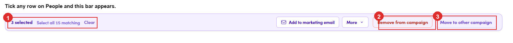

# 6.4.6 · The action bar

> 6 · Manage a campaign → 6.4 · Add and remove people

**Tick them on the People tab.** An action bar appears above the table: the count and **Select all N matching** / **Clear** on the left, and on the right **Add to marketing email**, **More**, **Remove from campaign** and **Move to other campaign**.

*6.4.6: ① what you have ticked · ② Remove from campaign · ③ Move to other campaign.*
