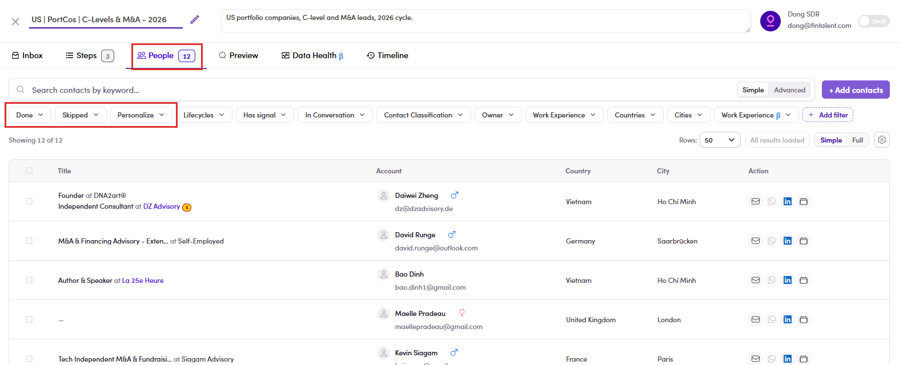

# 6.4 · Add and remove people

> 6 · Manage a campaign

The **People** tab is the campaign's recipient list. It carries the same filter bar as your lists plus **two filters only campaigns have**: **Done** (finished the whole sequence) and **Skipped**.

**Handed a campaign that already has people** and told not to add more? **Skip straight to** [6.5 · Preview](6-5-preview-and-review.md) and just work the contacts you were given ([6.x.6 ↗](6-x-6-assigned-skip-add.md)).

## Adding people

## Removing people

*6.4: the People tab with the campaign-only Done / Skipped filters.*

## In this step

* [6.4.1 · + Add contacts](6-4-1-add-contacts.md)
* [6.4.2 · The pre-filtered list](6-4-2-the-pre-filtered-list.md)
* [6.4.3 · Tick your people](6-4-3-tick-your-people.md)
* [6.4.4 · The drawer: 4 groups](6-4-4-the-drawer-4-groups.md)
* [6.4.5 · Add to campaign](6-4-5-add-to-campaign.md)
* [6.4.6 · Tick who to remove](6-4-6-tick-who-to-remove.md)
* [6.4.7 · Remove (no undo)](6-4-7-remove-no-undo.md)
