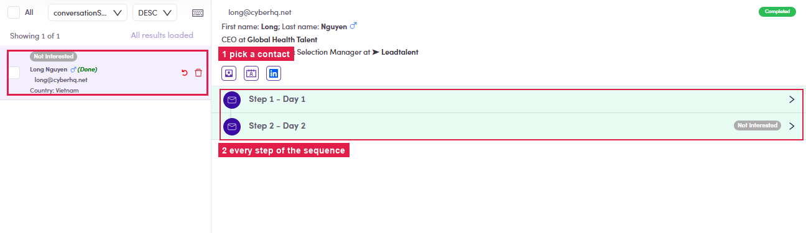

# 6.5.1 · Pick a contact

> 6 · Manage a campaign → 6.5 · Preview & review

**Open the Preview tab → click a contact** on the left. The right pane loads that contact's header (name · email · title & company · quick-jump icons) with **every step of the sequence** below it as collapsible rows — **Step 1 - Day 1**, **Step 2 - Day 2**, …

*6.5.1 — ① pick a contact (left) · ② every step of the sequence for that contact (right).*
